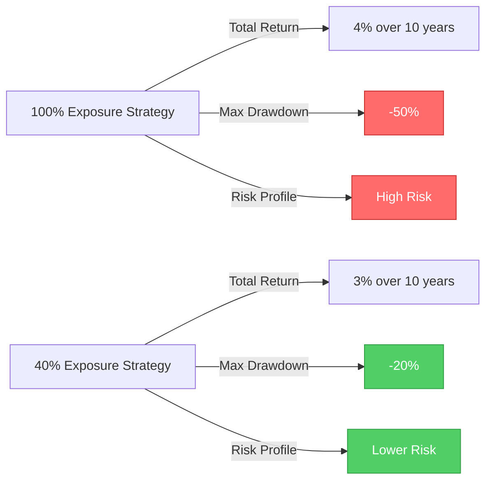
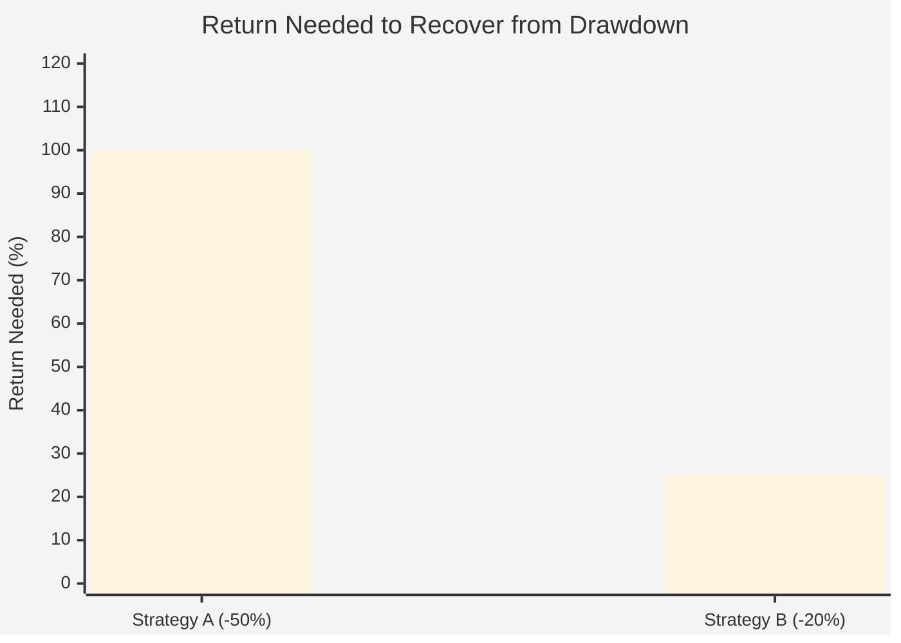
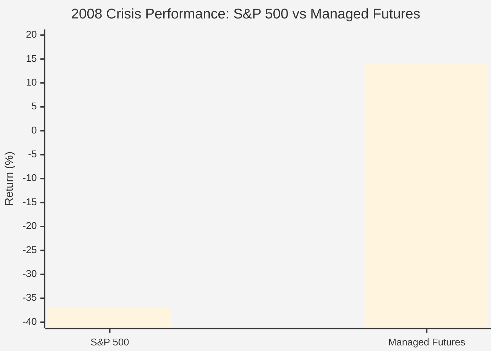
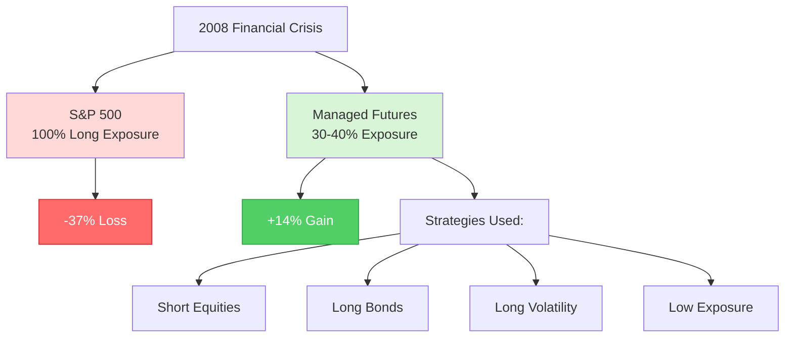
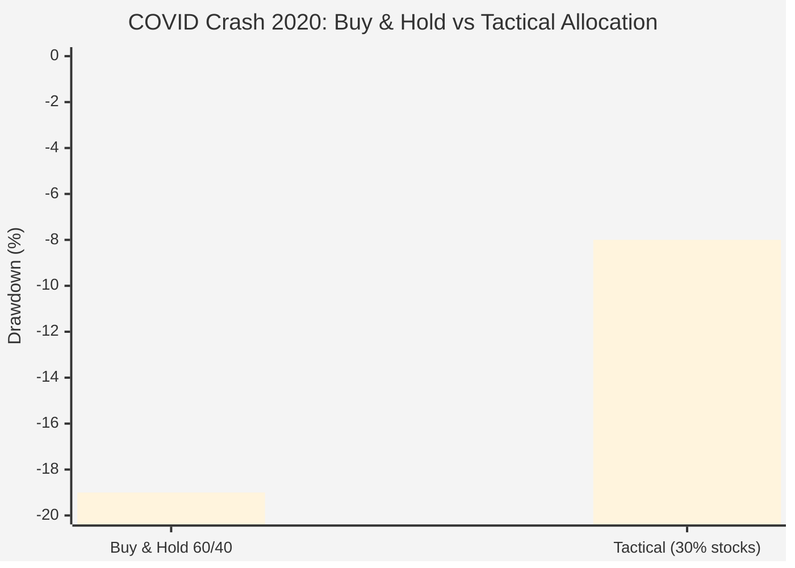
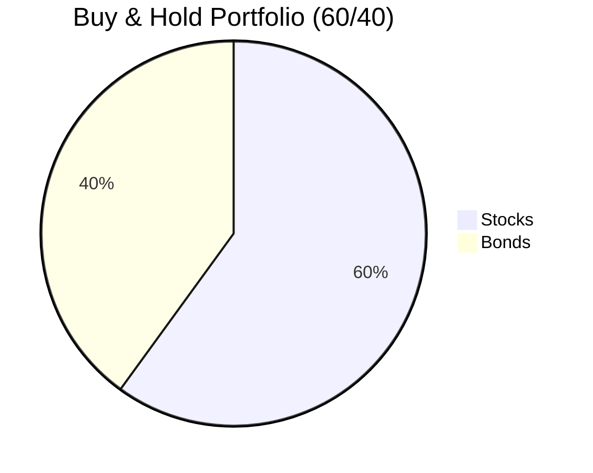
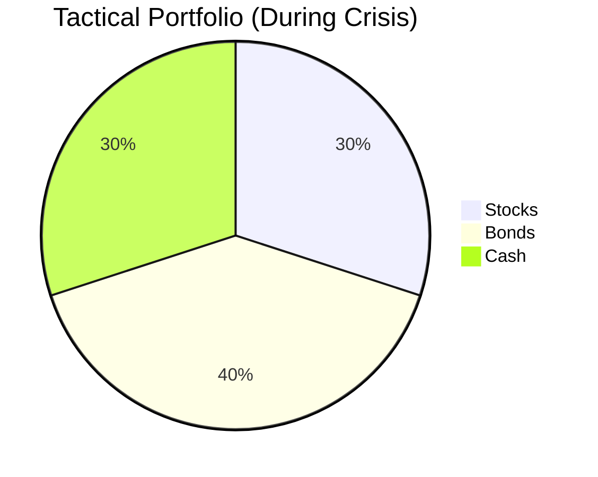

# ⚠️ WARNING: Black Swan Events and Trading Strategy Survival

## Overview

A **Black Swan event** is an unpredictable, rare occurrence with extreme consequences that, in hindsight, appears obvious. In financial markets, these events can destroy years of profits in hours, bankrupt hedge funds overnight, and make even the most robust backtests worthless.

> [!CAUTION]
> **Black Swans are inevitable.** The question is not *if* one will occur during your trading career, but *when*—and whether your strategy will survive it. Most algorithmic trading strategies that look brilliant in backtests have never been stress-tested against true tail-risk events.

This document explains what Black Swan events are, examines major historical examples, analyzes how markets behaved before and after each event, and provides guidance on building strategies that can survive the unsurvivable.

---

## What is a Black Swan Event?

### Defining Characteristics

According to Nassim Nicholas Taleb (who popularized the term), Black Swan events have three properties:

1. **Rarity**: The event is an outlier beyond normal expectations
2. **Extreme Impact**: The event carries massive consequences
3. **Retrospective Predictability**: After the fact, we create explanations making it seem predictable

### Why They Matter for Algorithmic Trading

Most algorithmic strategies are optimized on historical data that excludes or underweights extreme events. This creates several problems:

```
Historical Data (2015-2024):
- Average daily volatility: 1.2%
- Maximum drawdown: 15%
- Sharpe ratio: 1.8

Black Swan Event (Single Day):
- Intraday volatility: 35%
- Drawdown: 50%+
- All risk models break

Result: Strategy optimized for "normal" markets fails catastrophically
```

> [!WARNING]
> **The Backtest Illusion**: Your 10-year backtest showing consistent profits might include zero true Black Swan events. You're not prepared for what you haven't seen.

---

## Historical Black Swan Events

### 1. Black Monday (October 19, 1987)

**The Event:**
The Dow Jones Industrial Average crashed **22.6% in a single day**—the largest one-day percentage decline in stock market history.

**Before the Event:**
- **August-September 1987**: Market hitting all-time highs
- **Week before**: Minor weakness, but nothing alarming
- **Friday, October 16**: -4.6% (warning sign, but not unprecedented)
- **Weekend**: Tension building, but most expected a correction, not a crash

**Market Conditions Before:**
```
September 1987:
- DJIA: ~2,600 (near peak)
- VIX equivalent: Low teens (complacent)
- Trend: Strong bull market since 1982
- Sentiment: Euphoric, "new era" thinking
```

**The Crash (October 19, 1987):**
- **Opening**: Massive selling pressure
- **10:00 AM**: Down 10%
- **Noon**: Down 15%
- **Close**: Down **22.6%**
- **Volume**: Trading systems overwhelmed
- **Liquidity**: Many stocks had no bids

**After the Event:**
```
October 20, 1987: +5.9% (volatile recovery)
October 21: -8.0% (continued chaos)
Week after: Extreme volatility, 5-10% daily swings
Month after: Market down ~25% from pre-crash peak
Year after: Market recovered to pre-crash levels
```

**What Strategies Failed:**
- **Portfolio Insurance**: Automated selling programs amplified the crash
- **Trend Following**: Whipsawed by violent reversals
- **Mean Reversion**: Margin calls before recovery

**What Strategies Survived:**
- **Cash Holders**: Those who avoided the crash
- **Long-term Value Investors**: Who held through and added

---

### 2. Long-Term Capital Management Collapse (1998)

**The Event:**
A hedge fund staffed with Nobel Prize winners lost $4.6 billion in four months, nearly collapsing the global financial system.

**Before the Event:**
- **1994-1997**: LTCM returning 40%+ annually
- **Early 1998**: Asian financial crisis, but LTCM still confident
- **July 1998**: Russia seems stable

**Market Conditions Before:**
```
July 1998:
- LTCM Leverage: 25:1 (later peaked at 100:1)
- Strategy: Convergence trades (betting spreads would narrow)
- Returns: Stellar track record
- Risk Models: Assumed normal distributions
```

**The Crisis (August-September 1998):**
- **August 17**: Russia defaults on debt
- **August-September**: "Flight to quality" - all correlations go to 1
- **Spreads Widen**: Instead of converging, spreads exploded
- **Leverage Kills**: 25:1 leverage turned 10% loss into 250% loss
- **Liquidity Evaporates**: Couldn't exit positions

**After the Event:**
```
September 1998: Fed organizes $3.6B bailout
October 1998: Markets extremely volatile
End of 1998: Markets stabilized
2000: LTCM liquidated
```

**What Strategies Failed:**
- **High Leverage Arbitrage**: Small moves destroyed capital
- **Historical Correlation Models**: All correlations broke down
- **Liquidity Assumptions**: Couldn't exit positions

**What Strategies Survived:**
- **Low Leverage**: Those with 2-3x leverage, not 25x
- **Liquid Assets**: Could exit when needed

---

### 3. Dot-Com Crash (2000-2002)

**The Event:**
NASDAQ lost **78%** from peak to trough over 2.5 years; many tech companies went to zero.

**Before the Event:**
- **1995-1999**: Internet euphoria, "new economy" narrative
- **1999**: NASDAQ +85% in one year
- **Early 2000**: Peak valuations (Amazon P/E > 1000)

**Market Conditions Before:**
```
March 2000 (Peak):
- NASDAQ: 5,048
- Valuations: Extreme (revenue multiples, not earnings)
- IPOs: Companies with no profits going public
- Sentiment: "This time is different"
- Day Trading: Retail frenzy
```

**The Crash (March 2000 - October 2002):**
- **March 10, 2000**: NASDAQ peaks
- **March-April**: -34% in 6 weeks
- **Bounces**: Several 20-30% rallies (bear market traps)
- **2001**: September 11 accelerates decline
- **October 2002**: NASDAQ bottoms at 1,114 (-78%)

**After the Event:**
```
2002-2003: Bottoming process
2003-2007: Recovery, but tech never regained peak multiples
Many stocks: Never recovered (Pets.com, Webvan, etc.)
```

**What Strategies Failed:**
- **Momentum Long-Only**: Rode stocks from $100 to $0
- **Buy the Dip**: Kept buying, kept losing
- **Growth at Any Price**: Valuations collapsed

**What Strategies Survived:**
- **Valuation-Based**: Avoided bubble stocks
- **Short Bias**: Profitable on the way down
- **Diversified Beyond Tech**: Limited exposure

---

### 4. Global Financial Crisis (2008-2009)

**The Event:**
S&P 500 fell **57%** from peak to trough; major financial institutions collapsed; credit markets froze.

**Before the Event:**
- **2003-2007**: Housing bubble, easy credit
- **2007**: Subprime concerns emerge
- **Early 2008**: Bear Stearns bailout (March)

**Market Conditions Before:**
```
October 2007 (Peak):
- S&P 500: 1,565
- VIX: 15-20 (normal)
- Credit Spreads: Tight
- Housing Prices: Peak
- Financial Sector: Trading at all-time highs
```

**The Crisis (September 2008 - March 2009):**
- **September 15, 2008**: Lehman Brothers bankruptcy
- **September 16**: AIG bailout, Reserve Fund "breaks the buck"
- **September 17-19**: Money markets freeze
- **September 29**: -7% (TARP vote fails)
- **October 2008**: -17% (worst month since 1987)
- **November 2008**: -7%
- **Volatility**: VIX hits 89 (vs normal 15-20)
- **Liquidity**: Bid-ask spreads explode
- **March 9, 2009**: S&P bottoms at 676 (-57%)

**Daily Moves During Crisis:**
```
September 29, 2008: -8.8%
October 13, 2008: +11.6%
October 15, 2008: -9.0%
December 1, 2008: +9.0%
```

**After the Event:**
```
March 2009: Bottom
2009-2020: 11-year bull market
Many strategies: Never recovered losses
```

**What Strategies Failed:**
- **Leveraged Long**: Margin calls, wiped out
- **Financial Sector Longs**: Banks down 80-90%
- **Credit Strategies**: Spreads went from 2% to 20%
- **Volatility Short**: VIX went from 15 to 89

**What Strategies Survived:**
- **Low/No Leverage**: Could hold through
- **Tactical Cash Allocation**: Raised cash in 2008
- **Government Bonds**: Flight to safety
- **Gold**: Held value during panic

---

### 5. Flash Crash (May 6, 2010)

**The Event:**
Dow Jones fell **~1,000 points (9%) in minutes**, then recovered most losses within minutes.

**Before the Event:**
- **Morning of May 6**: Market slightly down
- **2:00 PM**: Normal trading
- **2:32 PM**: Selling pressure begins

**The Crash (2:32 PM - 3:00 PM):**
- **2:32 PM**: Large sell order for E-Mini S&P futures
- **2:40-2:45**: Cascade of algorithmic selling
- **2:45:28 PM**: DJIA down 998.5 points
- **Individual Stocks**: Some traded at $0.01, others at $100,000
- **Trading Halts**: Many stocks halted
- **Liquidity**: Completely evaporated
- **2:45-3:00 PM**: Rapid recovery

**What Happened:**
```
2:32 PM: DJIA 10,550
2:45 PM: DJIA 9,850 (-6.9%)
3:00 PM: DJIA 10,520 (almost fully recovered)

Duration of crash: ~15 minutes
```

**After the Event:**
```
End of Day: Down ~3% (normal correction)
Days After: Market nervous but functioning
Months After: Regulatory changes (circuit breakers)
```

**What Strategies Failed:**
- **Market-Making Algorithms**: Shut down, exacerbating crash
- **Stop Losses**: Executed at absurd prices
- **High-Frequency Arbitrage**: Couldn't process chaos

**What Strategies Survived:**
- **Manual Traders**: Could assess the irrationality
- **Those Without Stops**: Avoided panic selling

---

### 6. COVID-19 Crash (February-March 2020)

**The Event:**
S&P 500 fell **34%** in 23 trading days—the fastest bear market in history.

**Before the Event:**
- **2019**: Strong bull market (+29%)
- **January 2020**: New all-time highs
- **Early February**: Coronavirus concerns in China
- **February 19, 2020**: S&P 500 hits all-time high (3,386)

**Market Conditions Before:**
```
February 19, 2020:
- S&P 500: 3,386 (ATH)
- VIX: 14 (complacent)
- Sentiment: Bullish
- Economy: Strong employment, low rates
```

**The Crash (February 20 - March 23, 2020):**
- **February 24-28**: -11% in 5 days
- **March 9**: -7.6% (oil price war)
- **March 12**: -9.5% (2nd worst day since 1987)
- **March 16**: -12% (worst day since 1987)
- **March 18**: -6.3%
- **March 23**: S&P bottoms at 2,237 (-34%)
- **Circuit Breakers**: Triggered 4 times

**Characteristics:**
```
Volatility: VIX hit 82 (vs normal 15)
Speed: Fastest bear market ever
Daily Moves: Routine 5-10% swings
Correlations: Everything sold (stocks, bonds, gold, crypto)
Liquidity: Bid-ask spreads exploded
```

**After the Event:**
```
March 23: Bottom
March-April: +30% rally in weeks
April-December 2020: New all-time highs
Fed Response: Unlimited QE, rates to zero
```

**What Strategies Failed:**
- **Volatility Short (XIV)**: Shut down
- **Leveraged Bull ETFs**: Decay from volatility
- **Short-Vol Strategies**: Catastrophic losses
- **"Stocks Only Go Up"**: Learned painful lesson

**What Strategies Survived:**
- **Cash Reserves**: Could deploy at bottom
- **Long Volatility**: Huge profits
- **Trend Following**: Exited early
- **Diversified**: Bonds provided cushion (initially)

---

### 7. Archegos Capital Collapse (March 2021)

**The Event:**
A single family office's **$20 billion** forced liquidation caused **$10+ billion** in losses for major banks in days.

**Before the Event:**
- **2020-Early 2021**: Bull market
- **Archegos Strategy**: Highly leveraged long positions via total return swaps
- **Leverage**: Estimated 5-10x leverage
- **Stocks**: ViacomCBS, Discovery, others

**The Crisis (March 25-29, 2021):**
- **March 22-24**: ViacomCBS drops -20%
- **March 25**: Margin calls, banks start liquidating
- **March 26**: ViacomCBS -23%, Discovery -27%
- **March 29**: Multiple stocks down 30-50%
- **Banks**: Credit Suisse -$5.5B, Nomura -$3B

**What Made It a Black Swan:**
- **Hidden Risk**: Total return swaps hid concentration
- **Leverage**: Small move triggered spiral
- **Contagion**: Multiple banks affected
- **Speed**: Billions evaporated in days

---

## Common Patterns Across Black Swan Events

### Warning Signs (Often Ignored)

1. **Extreme Valuations**
   - Dot-com: P/E ratios > 100
   - 2008: Housing prices detached from income
   - "This time is different" narratives

2. **Excessive Leverage**
   - LTCM: 25-100x leverage
   - 2008: Banks at 30:1 leverage
   - Archegos: 5-10x hidden leverage

3. **Low Volatility/Complacency**
   - VIX < 15 before crashes
   - Credit spreads at historic tights
   - "Markets can't go down" sentiment

4. **Correlation Breakdowns**
   - Diversification fails when you need it most
   - All assets sell off together
   - Safe havens stop being safe

5. **Liquidity Illusions**
   - Markets liquid until they're not
   - Bid-ask spreads explode
   - Can't exit positions

### Market Behavior During Black Swans

**Phase 1: Initial Shock (Days 1-3)**
```
- Rapid decline (5-20%)
- Panic selling
- Liquidity evaporates
- Circuit breakers may trigger
- News tries to explain "why"
```

**Phase 2: Volatility Regime (Weeks 1-4)**
```
- Wild daily swings (±5-10%)
- False rallies (bear market traps)
- Correlations go to 1.0
- VIX elevated (40-80)
- Margin calls force selling
```

**Phase 3: Capitulation (Variable)**
```
- Final selling exhaustion
- Extreme pessimism
- "It will never recover" sentiment
- Often a V-bottom or multi-week base
```

**Phase 4: Recovery (Months to Years)**
```
- Gradual stabilization
- Reduced volatility
- Asset-specific recoveries
- Some assets never recover
```

---

## Impact on Algorithmic Trading Strategies

### Strategies Vulnerable to Black Swans

> [!CAUTION]
> These strategies look great in backtests but can be catastrophic during tail events:

#### 1. **Short Volatility Strategies**
```
Normal Times: Collect premium, slow steady gains
Black Swan: VIX from 15 → 80, account goes to zero

Example: XIV (Short Vol ETF) 
- 2010-2018: Smooth upward returns
- February 2018: Terminated after -95% loss in 2 days
```

#### 2. **High Leverage Arbitrage**
```
Normal Times: Small edge * high leverage = good returns
Black Swan: Spreads widen, margin calls, forced liquidation

Example: LTCM
- Normal: Making 40% annually
- Black Swan: Lost 90% in 4 months
```

#### 3. **Trend Following Without Risk Management**
```
Normal Times: Ride trends up
Black Swan: Whipsawed by 10% daily volatility

Problem: Stops get hit at worst prices
```

#### 4. **Mean Reversion in Panics**
```
Normal Times: Buy dips, profit from bounces
Black Swan: "Buy the dip" becomes "catch a falling knife"

Example: Buying financial stocks in 2008
- Bought at -30%? Stock went down another 70%
```

#### 5. **Correlation-Based Strategies**
```
Normal Times: Assets move independently, hedges work
Black Swan: All correlations → 1.0, hedges fail

2008: Stocks, bonds, commodities all sold off together
```

### Strategies That Survive Black Swans

> [!TIP]
> Build these characteristics into your strategies:

#### 1. **Limited Leverage (< 3x)**
```
Why: Can withstand 30% moves without margin calls
Example: 2x leverage with 34% drawdown = -68% (survives)
Example: 10x leverage with 10% drawdown = -100% (wiped out)
```

#### 2. **Tail Risk Hedges**
```
Strategy: Allocate 1-2% to out-of-money puts
Cost: Small drag in normal times (-1-2% annually)
Benefit: Massive payoff during crashes

Example: 2% in VIX calls
- Normal years: Lose the 2%
- Black Swan: +200% on that allocation, cushions portfolio
```

#### 3. **Dynamic Position Sizing**
```
Low volatility (VIX < 20): Normal position sizes
Rising volatility (VIX 20-30): Reduce by 50%
High volatility (VIX > 30): Reduce by 75-90%

This automatically de-risks before crashes accelerate
```

#### 4. **Maximum Drawdown Limits**
```
Hard Rule: If down 15% from peak, reduce exposure by 50%
If down 25% from peak, go to cash

Prevents riding a position from -15% to -80%
```

#### 5. **Diversification That Actually Works**
```
❌ Don't: 10 tech stocks (not diversified)
✅ Do: Multiple asset classes, strategies, timeframes

Example allocation:
- 40% stocks
- 30% bonds  
- 10% commodities
- 10% long volatility
- 10% cash
```

#### 6. **Crisis Alpha Strategies**
```
Strategies that profit from chaos:
- Long volatility
- Trend following (shorts during crashes)
- Flight-to-quality (long government bonds)
- Gold allocation
```

---

## Backtesting for Black Swan Resilience

### The Problem with Standard Backtests

Most backtests fundamentally underestimate tail risk:

```python
# Typical backtest
start_date = "2015-01-01"  # ❌ Misses 2008 crisis
end_date = "2024-01-01"
# This period had: No major crashes (except short COVID)
# Strategy looks amazing!

# Better backtest
start_date = "2000-01-01"  # ✅ Includes dot-com, 2008, COVID
end_date = "2024-01-01"
# Now you see how strategy handles real disasters
```

### Stress Testing Your Strategy

#### 1. **Include Crisis Periods**
```
Must include:
- 2000-2002 (Dot-com)
- 2008-2009 (Financial Crisis)
- 2020 (COVID)

Optional but valuable:
- 1987 (Black Monday)
- 1998 (LTCM)
- 2010 (Flash Crash)
```

#### 2. **Synthetic Stress Tests**
```python
# Simulate extreme scenarios
scenarios = [
    {"name": "Flash Crash", "drop": -20%, "duration": 1 day},
    {"name": "Bear Market", "drop": -50%, "duration": 12 months},
    {"name": "Volatility Spike", "vix": 80, "duration": 2 weeks},
]

for scenario in scenarios:
    test_strategy_under_scenario(scenario)
    if max_drawdown > 30%:
        print(f"FAIL: Strategy doesn't survive {scenario['name']}")
```

#### 3. **Monte Carlo with Fat Tails**
```python
# ❌ Wrong: Assume normal distribution
returns = np.random.normal(mean, std, 10000)

# ✅ Right: Use fat-tailed distribution
returns = np.random.standard_t(df=3, size=10000)  # Fatter tails
```

#### 4. **Correlation Breakdown Tests**
```
Test: What if all asset correlations → 1.0?
- Does your diversification still work?
- Can you survive if stocks and bonds both drop 20%?
```

#### 5. **Liquidity Stress Tests**
```
Assumption: Bid-ask spreads widen 10x
Question: Can you still exit positions profitably?

Example:
- Normal: 0.05% spread
- Crisis: 0.5% spread
- On 10 trades: Lose 5% to spreads alone
```

---

## Building Black Swan Resilient Strategies

### Design Principles

> [!IMPORTANT]
> **Principle 1: Survive First, Profit Second**
> 
> A strategy that survives 20 years making 8% annually beats one that makes 40% for 3 years then goes to zero.

**Principle 2: Assume Your Model is Wrong**

Your backtest assumptions will fail. Ask:
- What if volatility is 3x higher than historical?
- What if correlations break down?
- What if you can't exit positions?

**Principle 3: Asymmetric Risk/Reward**

```
❌ Bad: Risk $100 to make $100 (1:1)
✅ Good: Risk $100 to make $300 (1:3)
✅ Better: Risk $100 to make $300, but use tail hedge to cap loss at $50
```

**Principle 4: Multiple Layers of Protection**

Don't rely on one safety mechanism:

```
Layer 1: Position sizing limits (max 5% per position)
Layer 2: Stop losses (max -15% on position)
Layer 3: Portfolio drawdown limit (reduce at -10%)
Layer 4: Volatility adjustment (reduce when VIX > 25)
Layer 5: Tail hedge (long out-of-money puts)
```

### Practical Implementation

#### Strategy Checklist for Black Swan Resistance

- [ ] **Leverage < 3x** (preferably < 2x)
- [ ] **Maximum position size < 10%** of portfolio
- [ ] **Hard stop loss on every position** (max -15%)
- [ ] **Portfolio drawdown circuit breaker** (reduce at -10-15%)
- [ ] **Includes 2008-2009 in backtest** period
- [ ] **Tested with 2x-3x historical volatility**
- [ ] **Tail risk hedge** (1-2% in OTM puts or VIX calls)
- [ ] **Can survive 50% market drop** without margin call
- [ ] **Diversified across asset classes** not just securities
- [ ] **Cash reserves** (minimum 10-20%)
- [ ] **No reliance on constant liquidity**
- [ ] **Maximum drawdown < 30%** in worst historical period
- [ ] **Volatility-based position sizing**
- [ ] **Regular stress testing** (quarterly)
- [ ] **Exit plan** for systemic crisis

**Scoring:**
- **12-15 checks**: High resilience ✅
- **8-11 checks**: Moderate resilience ⚠️
- **< 8 checks**: High Black Swan risk ❌

---

## How Lower Market Exposure Mitigates Black Swan Risk

### The Time-in-Market Paradox

Traditional investing wisdom says "time in the market beats timing the market." This is true for long-term buy-and-hold investors. However, for algorithmic traders, **less time in the market can dramatically reduce Black Swan risk**.

> [!IMPORTANT]
> **The Core Principle**: You can only lose money when you're exposed to the market. If you're in cash, you're immune to crashes.

### The Mathematics of Exposure Time

#### Simple Probability Model

```
If there's a 5% chance of a Black Swan event in any given year:

Strategy A: Always 100% invested
- Years invested: 100%
- Probability of experiencing Black Swan over 10 years: ~40%

Strategy B: Invested 50% of the time (selective exposure)
- Years invested: 50%
- Probability of experiencing Black Swan: ~22%
- Risk reduction: 45%

Strategy C: Invested 25% of the time (highly selective)
- Years invested: 25%
- Probability of experiencing Black Swan: ~12%
- Risk reduction: 70%
```

**Key Insight**: Halving your market exposure time roughly halves your Black Swan risk exposure.

#### Real-World Impact

Let's examine two strategies over 10 years:

**Buy-and-Hold Strategy (100% exposure)**
```
Market exposure: 365 days/year × 10 years = 3,650 days
Black Swan days (2008 crash): Exposed to all 250 days of crisis
Drawdown: Full -50% market decline
```

**Tactical Strategy (30% exposure)**
```
Market exposure: ~110 days/year × 10 years = 1,100 days
Black Swan days: Statistically exposed to 30% × 250 = 75 days
Expected drawdown: 0.3 × -50% = -15% (vs -50%)
```

### Strategies with Lower Market Exposure

#### 1. **Trend Following**

Trend following strategies are typically in the market 30-50% of the time.

**Why Lower Exposure:**
- Only trades when clear trend exists
- Exits when trend breaks (goes to cash)
- Avoids choppy, directionless markets

**Example:**
```python
# Moving Average Crossover Trend Following
if fast_ma > slow_ma:
    position = LONG  # In market
elif fast_ma < slow_ma:
    position = CASH  # Out of market (50% of the time)
    
# Market exposure: ~50%
# During 2008 crash: Exited to cash early, avoided majority of decline
```

**Historical Performance in Crashes:**
```
2008 Crisis:
- S&P 500 (100% exposure): -37% for year
- Trend Following (35% exposure): +14% average for managed futures
- Why? Went short or to cash in early stages
```

#### 2. **Breakout Strategies**

Breakout strategies have even lower exposure (15-40% of the time).

**Why Lower Exposure:**
- Only trades during volatility expansions
- Most days are consolidation (no positions)
- Naturally avoids "boring" periods that precede crashes

**Example Characteristics:**
```
Typical breakout strategy:
Average trades per year: 5-10
Average position duration: 15-30 days
Time in market: ~10-20% 

Black Swan benefit:
- 80-90% of time NOT exposed to market
- If crash occurs randomly, high probability you're in cash
```

#### 3. **Seasonal/Calendar Strategies**

Some strategies only trade specific periods (e.g., "Sell in May and go away").

**Example:**
```
November-April: Invested (strongest 6 months historically)
May-October: Cash (weaker 6 months)

Market exposure: 50%
Black Swan risk: Reduced by ~50%

Historical note: October 1987, October 2008 crashes avoided
```

#### 4. **Volatility-Filtered Strategies**

Only trade when volatility is within specific ranges.

**Implementation:**
```python
if VIX < 15:  # Too calm (complacent)
    position = CASH  # Avoid pre-crash complacency
elif VIX > 30:  # Too volatile (crisis mode)
    position = CASH  # Avoid during panic
else:  # VIX 15-30
    position = TRADE_NORMALLY
    
# Result: ~60% exposure
# Automatically exits before and during most Black Swans
```

### The Trade-Off: Returns vs Risk

#### Lower Exposure = Lower Returns... But Safer

```
100% Exposure Strategy (Buy & Hold):
- Good years: +12% × 7 years = +84%
- Black Swan years: -40% × 1, -20% × 2 = -80%
- Total: +4% over 10 years
- Max Drawdown: -50%

40% Exposure Strategy (Tactical):
- Good years: +5% × 7 years = +35%
- Black Swan exposure: -16% × 1, -8% × 2 = -32%
- Total: +3% over 10 years
- Max Drawdown: -20%

Comparison:
- Similar returns (4% vs 3%)
- Much lower drawdown (50% vs 20%)
- Better sleep at night: Priceless
```

**Visual Comparison:**

```mermaid
%%{init: {'theme':'base', 'themeVariables': { 'primaryColor':'#ff6b6b','secondaryColor':'#4ecdc4'}}}%%
xychart-beta
    title "Returns vs Risk: 100% Exposure vs 40% Exposure"
    x-axis ["Total Return (10yr)", "Max Drawdown"]
    y-axis "Percentage (%)" -60 --> 10
    bar [4, -50]
    bar [3, -20]
```





#### The Compounding Advantage

Lower max drawdown means faster recovery:

```
Strategy A: -50% drawdown
Needs: +100% return to recover
Time to recover: 3-7 years historically

Strategy B: -20% drawdown  
Needs: +25% return to recover
Time to recover: 6-18 months

Strategy B gets back to compounding much faster
```

**Recovery Time Comparison:**

```mermaid
gantt
    title Recovery Time After Drawdown
    dateFormat X
    axisFormat %s
    
    section Strategy A (-50% DD)
    Drawdown Period: 0, 12
    Recovery Period: 12, 84
    
    section Strategy B (-20% DD)
    Drawdown Period: 0, 6
    Recovery Period: 6, 18
```





### Practical Implementation Examples

#### Example 1: Fixed Lower Exposure

```python
# Conservative approach
position_size = 0.25  # Max 25% per position
# Can have up to 4 positions max
# Effective exposure: 25-100%

# Benefits:
- Diversification across multiple positions
- Limits single-position risk
- Room to add during opportunities
```

#### Example 2: Volatility-Adjusted Exposure

```python
def calculate_position_size(vix, base_size=0.25):
    if vix < 15:
        # Too calm - reduce exposure (pre-crash complacency)
        return base_size * 0.5  # 12.5%
    elif vix < 25:
        # Normal - full exposure
        return base_size  # 25%
    else:  # vix >= 25
        # Crisis mode - minimal/no exposure
        return base_size * 0.25  # 6.25% or exit entirely
```

#### Example 3: Strategic Cash Allocation

```python
# Reserve portion for crisis opportunities
min_cash_reserve = 0.30  # Always keep 30% in cash
max_invested = 0.70      # Never more than 70% invested

# Benefits:
# 1. Can't lose on 30% (it's in cash)
# 2. Have dry powder to deploy post-crash
# 3. Psychological comfort during volatility

# During Black Swan:
# - 70% invested × 50% crash = -35% portfolio loss
# - vs 100% invested × 50% crash = -50% portfolio loss
# - 15% better outcome + you have cash to buy the dip
```

### Real-World Examples: Exposure and Black Swan Survival

#### Case Study 1: Managed Futures (Trend Following)

**2008 Financial Crisis:**
```
S&P 500 (100% long exposure): -37%
Average Managed Futures Fund (30-40% exposure): +14%

Why the difference?
1. Lower baseline exposure
2. Went short equities (negative exposure)
3. Long government bonds (safe haven)
4. Long volatility

Net exposure to equities: -20% to 0%
```

**Performance Comparison:**





#### Case Study 2: Tactical Asset Allocation

**COVID Crash 2020:**
```
Buy & Hold 60/40 Portfolio: -19% (Feb-March 2020)
Tactical Allocation (went to 30% stocks): -8%

How?
- Reduced equity exposure from 60% to 30% in late Feb
- Raised cash from 0% to 30%
- Kept bond allocation at 40%

Net equity exposure: 30% vs 60%
Drawdown reduction: 58% less severe
```

**Drawdown Comparison:**



**Portfolio Allocation Breakdown:**





### When Lower Exposure Matters Most

> [!TIP]
> **Lower exposure is most valuable during:**

1. **Market Tops** (Pre-crash complacency)
   - VIX < 12 (extremely low)
   - Record highs with no pullbacks for 6+ months
   - Extreme investor euphoria

2. **Transition Periods** (Regime changes)
   - Tightening monetary policy
   - Rising volatility (VIX climbing from 15 to 25)
   - Diverging market internals

3. **After Long Bull Runs** (Mean reversion risk)
   - 5+ years without 20% correction
   - Valuations at historic highs
   - Leverage metrics elevated

### The Optimal Exposure Strategy

There's no universal answer, but here's a framework:

```python
def calculate_optimal_exposure(market_conditions):
    """
    Adjust exposure based on multiple factors
    """
    base_exposure = 0.60  # Start with 60% max
    
    # Factor 1: VIX level
    if vix < 12:
        vix_mult = 0.5   # Cut in half (complacency)
    elif vix < 20:
        vix_mult = 1.0   # Normal
    elif vix < 30:
        vix_mult = 0.7   # Reduce
    else:
        vix_mult = 0.2   # Crisis - minimal exposure
    
    # Factor 2: Drawdown from peak
    if drawdown < 0.05:
        dd_mult = 1.0    # Near highs
    elif drawdown < 0.15:
        dd_mult = 0.8    # Moderate decline
    else:
        dd_mult = 1.2    # Deep decline - opportunity
    
    # Factor 3: Time since last crash
    years_since_crash = get_years_since_last_20pct_decline()
    if years_since_crash > 7:
        time_mult = 0.7  # Overdue for correction
    else:
        time_mult = 1.0
    
    final_exposure = base_exposure * vix_mult * dd_mult * time_mult
    return max(0.1, min(0.8, final_exposure))  # Cap at 10-80%
```

### Key Insights

1. **You Can't Lose When You're Not Playing**
   - 0% exposure = 0% Black Swan risk
   - 50% exposure = 50% Black Swan risk
   - Simple but powerful

2. **Selectivity is Protection**
   - Trade only highest-conviction setups
   - Fewer trades = less exposure = less risk
   - Quality over quantity

3. **Cash is NOT a Drag** (During Volatility)
   - Normal times: Cash "costs" 0-5% opportunity cost
   - Black Swan: Cash "saves" 30-50% vs full exposure
   - Insurance mindset

4. **Asymmetric Payoff**
   - Lower exposure costs little in bull markets (7-8% vs 10%)
   - Lower exposure saves massively in crashes (-15% vs -50%)
   - Risk-adjusted returns superior

5. **Recovery Speed**
   - Lower drawdown = faster recovery
   - Faster recovery = sooner back to compounding
   - Compounding is where wealth is built

---

## The Psychology of Black Swans

### Why We Fail to Prepare

1. **Recency Bias**: "No crash in 10 years → won't happen"
2. **Normalcy Bias**: "Markets can't go down 50%"
3. **Overconfidence**: "My strategy is different"
4. **Availability Heuristic**: Recent calm → assume future calm
5. **Optimism Bias**: Focus on upside, ignore tail risk

### Mental Models for Traders

**Model 1: It's Not About Prediction**

You can't predict Black Swans. You can only prepare to survive them.

```
❌ Wrong Approach: "When will the crash happen?"
✅ Right Approach: "Will my strategy survive a crash?"
```

**Model 2: Tail Risk is Expensive—Until It's Not**

```
Tail hedge cost: -1% annually
Years without crash: -1%, -1%, -1%, -1%, -1% (total -5%)
Year with crash: Hedge +200%, saves you from -40%

Net result: Saved 35% - 5% = 30% advantage
```

**Model 3: Slow and Steady Wins**

```
Aggressive Strategy:
Year 1-3: +40% each year
Year 4: -90% (Black Swan)
End Result: +18% total

Conservative Strategy:
Year 1-4: +12% each year
End Result: +57% total

The "boring" strategy won by 3x
```

---

## Final Wisdom

> [!WARNING]
> **The Trader's Paradox**: The longer you go without experiencing a Black Swan, the more vulnerable you become.
> 
> Why? Because success breeds complacency, complacency breeds leverage, and leverage breeds catastrophe.

### Key Takeaways

1. **Black Swans are inevitable** - Plan for them, don't predict them
2. **Backtests lie** - 10 years of profits can vanish in 10 days
3. **Leverage kills** - Every major blow-up involved excessive leverage
4. **Diversification fails** - When you need it most, correlations → 1
5. **Survival > Performance** - Staying in the game is more important than max returns
6. **Tail hedges save portfolios** - Small insurance cost, huge protection
7. **Position sizing is everything** - 95% in one position is suicide
8. **Volatility is your friend** - Use VIX to size positions
9. **Cash is a position** - Not being invested is a valid strategy
10. **Test in crisis periods** - If your strategy can't handle 2008, it's not ready

### The Ultimate Test

**Can your strategy survive:**
- A 50% market drop in 12 months? (2008)
- A 30% drop in 3 weeks? (COVID)
- A 20% drop in 1 day? (1987)
- VIX at 80 for a week?
- All correlations going to 1.0?
- Liquidity evaporating?
- Being forced to hold positions you want to exit?

If the answer to any of these is "no" or "uncertain," you're not ready for live trading.

---

## Additional Resources

**Books:**
- "The Black Swan" by Nassim Nicholas Taleb
- "When Genius Failed" by Roger Lowenstein (LTCM)
- "The Big Short" by Michael Lewis (2008 crisis)
- "Flash Boys" by Michael Lewis (Market structure)
- "Antifragile" by Nassim Nicholas Taleb

**Papers:**
- "The Statistics of Sharpe Ratios" by Andrew Lo
- "Fat Tails and Tail Risk" - Various hedge fund letters
- Post-mortem reports from major crashes

**Historical Data:**
- Study daily returns during crisis periods
- Analyze correlation matrices during crashes
- Review VIX behavior in panic events

---

**Remember: The market has humbled every genius who thought they had it figured out. Respect tail risk. Build for survival. Trade another day.**

**Black Swans don't care about your backtest.**
