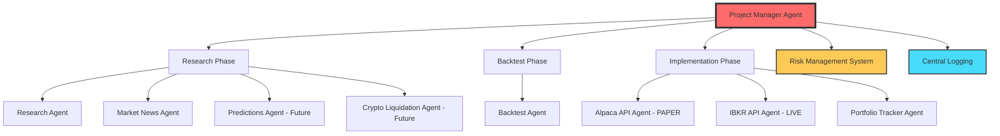
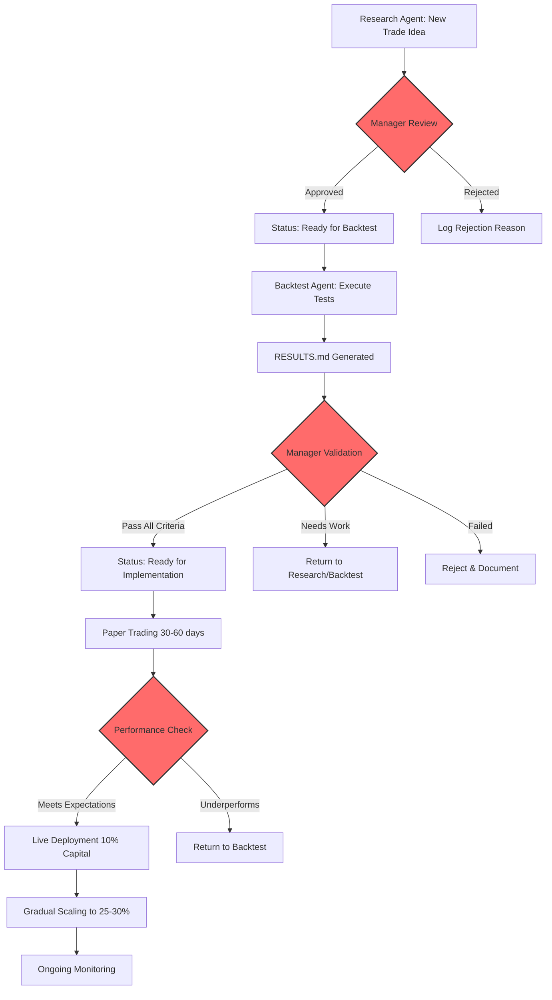
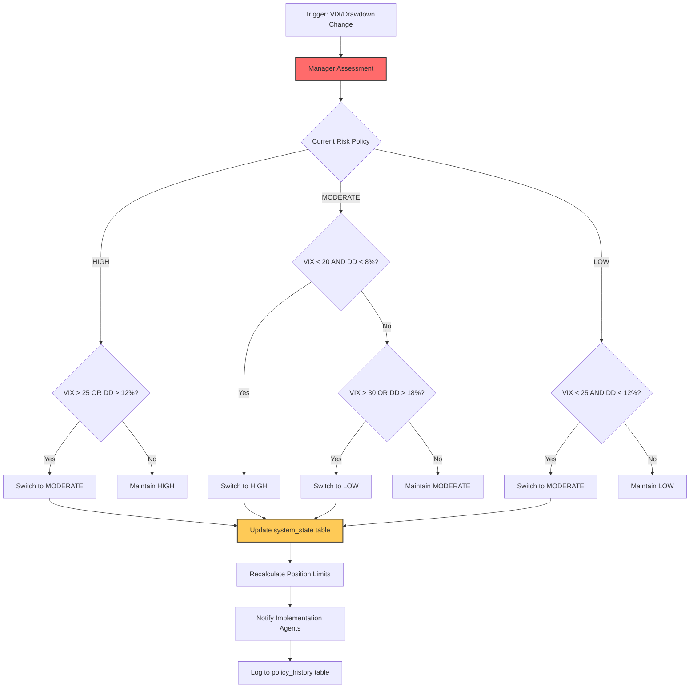
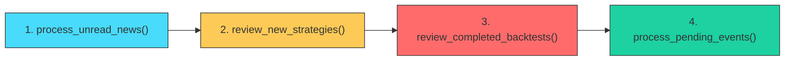

# Project Manager Agent: Orchestrating the Algorithmic Trading Robot

## Overview

The **Project Manager Agent** is the authoritative coordinator of the algorithmic trading robot system, overseeing all specialized AI agents and ensuring seamless integration across the Research, Backtest, and Implementation (RBI) workflow. This agent has executive control over the entire trading operation, coordinating strategy development, validation, deployment, and ongoing portfolio management.

## Purpose

The Project Manager Agent serves as:

1. **Central Coordinator** - Orchestrates workflow between Research, Backtest, and Implementation agents
2. **Strategic Decision-Maker** - Authorizes strategy deployment and risk policy changes
3. **Quality Controller** - Validates that each phase meets required standards before progression
4. **Risk Overseer** - Monitors system-wide risk exposure and enforces risk management protocols
5. **Performance Analyzer** - Tracks overall system performance and identifies optimization opportunities
6. **Crisis Manager** - Coordinates emergency responses during market stress events

---

## System Architecture

The Project Manager Agent oversees a multi-agent ecosystem built on the RBI (Research, Backtest, Implementation) methodology:



---

## Agent Ecosystem

### Research Phase Agents

#### 1. Research Agent
- **Location**: [`agents/research/strategy/`](agents/research/strategy/)
- **SKILL**: [SKILL.md](agents/research/strategy/SKILL.md)
- **Purpose**: Systematic trade strategy research and hypothesis generation
- **Outputs**: Trade ideas inserted into `strategies` table in `data/tradebot.db` with `NEW` status
- **Resources**: Google Scholar, academic papers, trading books, podcasts (Chat With Traders), YouTube (Moon Dev)
- **Key Documents**: 
  - [README.md](agents/research/strategy/README.md) - Research methodology
  - [OPTIONS_STRATEGIES.md](agents/research/strategy/OPTIONS_STRATEGIES.md) - Comprehensive options strategy guide
  - `data/tradebot.db` → `strategies` table — Active strategy ideas

#### 2. Market News Agent
- **Location**: [`agents/research/market_news/`](agents/research/market_news/)
- **SKILL**: [SKILL.md](agents/research/market_news/SKILL.md)
- **Purpose**: Monitor global market news and assess trade strategy adjustments
- **Focus**: USD-centric impact analysis, data-backed news only (no speculation)
- **Sources**: Bloomberg, Financial Times, WSJ, Reuters, CNBC, MarketWatch
- **Outputs**: 
  - `data/tradebot.db` → `market_news` table — News events and strategy impacts
  - Daily market briefings
  - Event-specific impact assessments  
  - Automated feed to Research agent (opportunities → trade ideas)
- **Integration**: News assessments → Research agent → `strategies` table → Backtest agent

#### 3. Predictions Agent *(Not Yet Developed)*
- **Location**: [`agents/research/predictions/`](agents/research/predictions/)
- **Planned Purpose**: Strategy suggestions based on machine learning market prediction models
- **Future Capabilities**: 
  - Predictive analytics on market movements
  - AI-generated strategy refinements
  - Model-based trade recommendations

#### 4. Crypto Liquidation Agent *(Not Yet Developed)*
- **Location**: [`agents/research/crypto_liquidation/`](agents/research/crypto_liquidation/)
- **Planned Purpose**: Track crypto liquidation rates and whale account activity
- **Future Capabilities**:
  - Real-time liquidation monitoring
  - Whale wallet tracking
  - Crypto sentiment analysis
  - Liquidation-based trade signals

---

### Backtest Phase Agent

#### 5. Backtest Agent
- **Location**: [`agents/backtest/`](agents/backtest/)
- **SKILL**: [SKILL.md](agents/backtest/SKILL.md)
- **Purpose**: Validate trade strategies through rigorous historical testing
- **Critical Documents**:
  - [README.md](agents/backtest/README.md) - Backtesting best practices
  - [OVEROPTIMIZE_WARNING.md](agents/backtest/OVEROPTIMIZE_WARNING.md) - Overfitting prevention
  - [BLACKSWANS.md](agents/backtest/BLACKSWANS.md) - Black swan resilience requirements
- **Validation Requirements**:
  - Out-of-sample testing (minimum 30% of data)
  - Walk-forward analysis
  - Cross-asset validation
  - Regime testing (bull/bear/sideways)
  - Black swan stress tests (2008, COVID, synthetic crashes)
  - Statistical significance (minimum 100+ trades)
- **Outputs**: `data/backtests/test<N>/RESULTS.md` with comprehensive backtest documentation
- **Success Criteria**: Strategy marked "✅ Ready for Implementation"

---

### Implementation Phase Agents

#### 6. Alpaca API Agent (Paper Trading)
- **Location**: [`agents/brokers/alpaca/`](agents/brokers/alpaca/)
- **SKILL**: [SKILL.md](agents/brokers/alpaca/SKILL.md)
- **Purpose**: **PAPER TRADING ONLY** - Test all order types before live execution
- **Capabilities**:
  - Paper trading environment (no real money)
  - Stock orders (market, limit, stop, bracket)
  - Crypto orders (for testing)
  - Portfolio status monitoring
  - Automatic order logging to CSV
- **Key Scripts**:
  - `alpaca_connection.py` - API connection & portfolio status
  - `orders.py` - Order submission & management
  - `order_logger.py` - Order history tracking
  - `data/tradebot.db` → `trades` table — Persistent order archive
- **Usage**: Test strategies here before deploying to IBKR live trading

#### 7. IBKR API Agent (Live Trading)
- **Location**: [`agents/brokers/ibkr/`](agents/brokers/ibkr/)
- **SKILL**: [SKILL.md](agents/brokers/ibkr/SKILL.md)
- **Purpose**: **LIVE TRADING** - Execute real trades for stocks, options, futures
- **Capabilities**:
  - Live trading with real money
  - Stock orders (market, limit, stop)
  - Options and futures support
  - Session management (auto-keepalive)
  - Order confirmation handling
  - Automatic order logging to CSV
- **Key Scripts**:
  - `ibkr_connection.py` - Gateway connection & portfolio status
  - `ibkr_orders.py` - Order submission & management
  - `ibkr_session_manager.py` - Background session keepalive
- **Requirements**:
  - Gateway running on localhost:5000
  - Manual browser authentication
  - Two-factor authentication
- **Risk Integration**: All orders validated against active risk policy
- **Note**: Does NOT support crypto - use OKX for crypto trading (US endpoint: us.okx.com)

#### 8. Portfolio Tracker Agent
- **Location**: [`agents/portfolio_tracker/`](agents/portfolio_tracker/)
- **SKILL**: [SKILL.md](agents/portfolio_tracker/SKILL.md)
- **Purpose**: Dynamic risk policy management and portfolio health monitoring
- **Risk Policies**:
  - **HIGH** (Aggressive Growth): 80/20 Growth/Preservation - Default stance
  - **MODERATE** (Balanced): 60/40 - Transitional during volatility spikes
  - **LOW** (Conservative): 30/70 - Survival mode during crisis
- **Key Capabilities**:
  - VIX-based policy switching
  - Drawdown monitoring and circuit breakers
  - Market regime detection
  - Portfolio health tracking
- **Philosophy**: Default to aggressive growth (HIGH), only defensive during severe market stress
- **Key Scripts**:
  - `risk_override.py` - Multi-policy risk validation system
   - `data/tradebot.db` → `system_state` table (key=`risk_mode`) — Current policy
   - `data/tradebot.db` → `policy_history` table — Policy change audit trail

---

## Project Manager Responsibilities

### 1. Workflow Orchestration

The Project Manager coordinates the complete strategy lifecycle:

#### Stage 1: Research Phase

**Objective**: Generate validated trade strategy hypotheses

**Manager Actions**:
1. **Initiate Research**: Direct Research Agent or Market News Agent to investigate specific market opportunities
2. **Review Trade Ideas**: Evaluate entries in `strategies` table for:
   - Clear, testable hypothesis
   - Sound theoretical foundation
   - Specific entry/exit conditions
   - Risk management parameters
   - Success criteria definition
3. **Quality Gate**: Approve or reject trade ideas for backtesting
4. **Status Update**: Mark approved ideas as "Ready for Backtest"

**Approval Criteria**:
- ✅ Hypothesis grounded in research (not speculation)
- ✅ Clearly defined parameters
- ✅ Risk factors identified
- ✅ Expected performance characteristics documented
- ✅ Data requirements specified

**Automated Workflow: Market News → Research → Backtest**

The system supports fully automated strategy idea generation:

```python
# Step 1: Market News agent discovers opportunity
from agents.common.database import get_db_session
from agents.common.models import MarketNews, Strategy
from agents.common.enums import ImpactRating, StrategyStatus

# Step 2: Research agent queries for high-severity events with opportunities
with get_db_session() as session:
    high_priority = (
        session.query(MarketNews)
        .filter(MarketNews.impact_rating.in_([ImpactRating.CRITICAL, ImpactRating.HIGH]))
        .filter(MarketNews.opportunities_identified.isnot(None))
        .all()
    )

    # Step 3: Research agent creates trade ideas
    for news in high_priority:
        strategy = Strategy(
            name=f"{news.headline} Strategy",
            notes=f"NEWS-DRIVEN from news #{news.id}: {news.headline}",
            status=StrategyStatus.NEW,
            news_id=news.id,
        )
        session.add(strategy)

# Step 4: Backtest agent automatically processes READY_FOR_BACKTEST strategies
with get_db_session() as session:
    ready = session.query(Strategy).filter_by(status=StrategyStatus.READY_FOR_BACKTEST).all()
```

**Data Flow**:
1. News event → `market_news` table (with `opportunities_identified`)
2. Research agent queries DB → creates detailed strategy → `strategies` table (with NEWS-DRIVEN tag)
3. Backtest agent queries DB → tests strategies with `READY_FOR_BACKTEST` status
4. Manager reviews RESULTS.md → approves for implementation

---

#### Stage 2: Backtest Phase

**Objective**: Validate strategies through rigorous historical testing

**Manager Actions**:
1. **Assign Backtesting**: Direct Backtest Agent to test approved trade ideas
2. **Monitor Progress**: Track backtest execution and identify issues
3. **Review Results**: Evaluate `test<N>/RESULTS.md` for:
   - Performance metrics (Sharpe ratio, returns, drawdown)
   - Validation completeness (OOS, walk-forward, regime testing)
   - Overfitting risk assessment
   - Black swan stress test results
   - Statistical significance
4. **Validation Gate**: Determine if strategy meets implementation standards
5. **Decision**:
   - ✅ **APPROVED**: Mark "Ready for Implementation" → Proceed to Implementation
   - ⚠️ **CONDITIONAL**: Requires modifications → Return to Research/Backtest
   - ❌ **REJECTED**: Failed validation → Log lessons learned, discard strategy

**Validation Requirements** (All Must Pass):
- ✅ Sharpe Ratio ≥ 0.5 (preferably ≥ 1.0)
- ✅ Maximum Drawdown ≤ 25% (preferably ≤ 15%)
- ✅ Sample Size ≥ 100 trades
- ✅ Out-of-sample performance ≥ 70% of in-sample
- ✅ Walk-forward analysis successful (>70% profitable windows)
- ✅ Survives black swan stress tests (2008, COVID)
- ✅ Parameter robustness confirmed
- ✅ Transaction costs included and strategy remains profitable

---

#### Stage 3: Implementation Phase

**Objective**: Deploy validated strategies to live/paper trading

**Manager Actions**:

**Phase 3A: Paper Trading Deployment**
1. **Configure Strategy**: Set validated parameters from backtest results
2. **Assign Implementation Agent**: Direct Alpaca agent to deploy strategy
3. **Set Risk Limits**: Configure position sizing and stop-loss parameters
4. **Enable Monitoring**: Track paper trading performance vs. backtest expectations
5. **Evaluation Period**: Minimum 30-60 days of paper trading
6. **Validation**: Paper trading metrics must align with backtest (±20% tolerance)

**Phase 3B: Live Trading Deployment** (After successful paper trading)
1. **Capital Allocation**: Start with 10-25% of intended capital
2. **Gradual Scaling**: Increase allocation as strategy proves reliability
3. **Performance Monitoring**: Daily review of strategy P&L and adherence to backtest expectations
4. **Risk Oversight**: Continuous monitoring of drawdown and position sizing compliance
5. **Adjustment Authorization**: Approve parameter tweaks or strategy pauses based on performance

**Phase 3C: Ongoing Management**
1. **Daily Operations Review**: Portfolio status, open positions, pending orders
2. **Weekly Performance Analysis**: Strategy-by-strategy P&L, win rates, adherence to risk policy
3. **Monthly Strategy Review**: Evaluate if strategies still align with market regimes
4. **Quarterly Revalidation**: Reassess strategies against updated market data

---

### 2. Risk Management Oversight

The Project Manager has **final authority** over all risk-related decisions.

#### Risk Policy Control

**Three-Tier Risk System**:

| Policy | Stance | Max Drawdown | Max Leverage | Single Position Max |
|--------|--------|--------------|--------------|---------------------|
| **HIGH** | Aggressive Growth (Default) | 35% | 3x | 30% |
| **MODERATE** | Balanced (Transitional) | 25% | 2x | 20% |
| **LOW** | Conservative (Survival) | 15% | 1.2x | 12% |

**Manager Authority**:
- Switch between risk policies based on:
  - VIX levels (market volatility)
  - Portfolio drawdown
  - Market regime changes
  - Black swan events
- Override Portfolio Tracker Agent recommendations if necessary
- Authorize emergency defensive positioning

**Risk Policy Decision Framework**:

```
VIX < 25 AND Drawdown < 12% → HIGH (Aggressive Growth)
VIX 25-30 OR Drawdown 12-18% → MODERATE (Transitional)
VIX > 30 OR Drawdown > 18% → LOW (Survival Mode)
VIX > 35 OR Drawdown > 22% → LOW (Black Swan Protocol)
```

**Philosophy**: 
- **Default to HIGH** for maximum growth during normal conditions
- **Use MODERATE sparingly** as a buffer during volatility spikes
- **Switch to LOW immediately** during crisis conditions
- **Return to HIGH quickly** after market stabilization

#### Circuit Breakers

The Manager enforces automatic trading halts at:

| Risk Policy | Circuit Breaker Threshold |
|-------------|---------------------------|
| HIGH | 22% portfolio drawdown |
| MODERATE | 18% portfolio drawdown |
| LOW | 12% portfolio drawdown |

**Circuit Breaker Actions**:
1. **Immediate**: Halt all new position openings
2. **Urgent**: Close positions with open losses exceeding stop-loss limits
3. **Assessment**: Manager reviews all open positions and market conditions
4. **Decision**: Determine recovery strategy or full liquidation
5. **Resumption**: Trading resumes only with Manager explicit approval

---

### 3. Strategy Portfolio Management

The Manager maintains optimal strategy diversification and capital allocation.

#### Strategy Allocation Principles

**Diversification Requirements**:
- **Maximum 3-5 active strategies** simultaneously
- **Different strategy types**: Mix of momentum, mean-reversion, income, volatility
- **Different timeframes**: Intraday, swing, position trading
- **Different assets**: Stocks, options, crypto (if applicable)
- **Low correlation**: Strategies should not fail simultaneously

**Capital Allocation**:
- **Equal Weight Initial**: Start with equal capital per strategy
- **Performance-Based Adjustment**: Scale up winners, scale down underperformers
- **Maximum Per Strategy**: No single strategy exceeds 40% of total capital
- **Reserve Capital**: Always maintain 20-30% cash for opportunities and risk management

**Strategy Lifecycle**:

```
Research → Backtest → Paper Trading (30-60 days) → 
Live (10% capital) → Gradual Scale (up to 25-30%) → 
Mature (maintain/optimize) → Retire (if stops working)
```

**Performance Monitoring Triggers**:
- **Underperformance**: Strategy returns < 50% of backtest expectations for 90 days → Review
- **Drawdown Exceeded**: Strategy drawdown > 1.5x backtest max drawdown → Reduce size or pause
- **Regime Mismatch**: Market regime changed and strategy not designed for current regime → Pause
- **Correlation Breakdown**: Strategy now correlates with others → Re-evaluate diversification

---

### 4. Market Intelligence Integration

The Manager synthesizes insights from Market News Agent to inform strategic decisions.

#### Daily Market Assessment Workflow

**Pre-Market Routine** (Before 9:30 AM EST):
1. **Review Market News Agent Briefing**: Key overnight developments, economic calendar
2. **Check VIX Levels**: Determine if risk policy adjustment needed
3. **Portfolio Health Review**: Current drawdown, position status, P&L
4. **Risk Policy Decision**: Confirm or switch risk policy for the day
5. **Strategy Activation**: Determine which strategies should be active based on market conditions

**Intraday Monitoring**:
1. **Breaking News Response**: When Market News Agent flags critical events:
   - Assess impact on open positions
   - Determine if immediate action required
   - Coordinate with implementation agents for adjustments
2. **Volatility Spikes**: If VIX increases >10 points:
   - Immediate risk policy reassessment
   - Consider defensive positioning
   - Tighten stop-losses on vulnerable positions

**Post-Market Review** (After 4:00 PM EST):
1. **Daily Performance Summary**: Review all strategy P&L
2. **News Impact Analysis**: Correlate market news with performance
3. **Lessons Learned**: Document unexpected behaviors or outcomes
4. **Next Day Preparation**: Set alerts, watchlists, planned actions

#### Market Regime Classification

The Manager maintains awareness of current market regime to inform strategy deployment:

| Regime | Characteristics | Favored Strategies | Risk Policy |
|--------|-----------------|-------------------|-------------|
| **Bull Market** | VIX < 15, trending up, low volatility | Momentum, breakouts, long bias | HIGH |
| **Bear Market** | VIX > 25, trending down, high volatility | Short strategies, protective puts, mean reversion | MODERATE/LOW |
| **Sideways** | VIX 15-20, range-bound, choppy | Iron condors, theta strategies, mean reversion | HIGH/MODERATE |
| **High Volatility** | VIX > 30, wide swings, uncertainty | Straddles, tail hedges, low exposure | LOW |
| **Crisis** | VIX > 35, panic selling, liquidity issues | Capital preservation, cash, treasuries | LOW |

---

### 5. Quality Assurance & Compliance

The Manager enforces quality standards across all phases.

#### Research Phase QA

**Trade Idea Review Checklist**:
- [ ] Hypothesis is specific and testable
- [ ] Source citations for key claims
- [ ] Entry/exit conditions clearly defined
- [ ] Risk management rules specified
- [ ] Success criteria established
- [ ] Data requirements identified
- [ ] Expected performance characteristics documented
- [ ] Red flags assessed (overfitting risk, data mining concerns)

#### Backtest Phase QA

**Validation Checklist** (see [Backtest/SKILL.md](agents/backtest/SKILL.md)):
- [ ] RESULTS.md complete with all required sections
- [ ] Default parameters tested
- [ ] Optimization performed (if applicable) with <100 combinations
- [ ] Out-of-sample testing conducted (≥30% of data)
- [ ] Walk-forward analysis completed
- [ ] Cross-asset validation performed
- [ ] Regime testing (bull/bear/sideways) completed
- [ ] Black swan stress tests passed
- [ ] Statistical significance confirmed (≥100 trades)
- [ ] Overfitting risk assessment documented
- [ ] Transaction costs included
- [ ] Final status: "✅ Ready for Implementation"

#### Implementation Phase QA

**Deployment Checklist**:
- [ ] Validated parameters configured correctly
- [ ] Risk limits set (position sizing, stop-loss, drawdown)
- [ ] Order execution agent tested (connection, API credentials)
- [ ] Order logging enabled
- [ ] Performance monitoring dashboard active
- [ ] Alerts configured (drawdown, performance deviation)
- [ ] Paper trading period completed successfully
- [ ] Capital allocation approved by Manager

---

### 6. Crisis Management

The Manager coordinates rapid response during market crises or system failures.

#### Crisis Detection Triggers

**Market Crisis**:
- VIX spike >10 points in one day
- S&P 500 drops >3% intraday
- Circuit breakers triggered on exchanges
- Geopolitical events (war, terrorism)
- Flash crashes or extreme volatility

**System Crisis**:
- Multiple strategies hitting stop-losses simultaneously
- Portfolio drawdown approaching circuit breaker
- API connection failures
- Order execution errors
- Data feed failures

#### Emergency Response Protocol

**Level 1: Heightened Alert** (VIX 25-30 or Drawdown 12-15%)
1. Switch to MODERATE risk policy
2. Tighten stop-losses by 25%
3. Reduce new position sizes by 50%
4. Increase monitoring frequency (hourly checks)
5. Prepare defensive adjustments

**Level 2: Defensive Mode** (VIX 30-35 or Drawdown 15-20%)
1. Switch to LOW risk policy
2. Close positions with deteriorating risk/reward
3. Halt new position openings except defensive
4. Increase cash allocation to 40%+
5. Consider protective hedges (VIX calls, index puts)
6. Continuous monitoring

**Level 3: Survival Mode** (VIX >35 or Drawdown >20%)
1. Activate circuit breaker
2. Close all non-essential positions
3. Move to 60%+ cash
4. Deploy capital preservation strategies only
5. Pause all aggressive strategies
6. Daily review with full reassessment

**Recovery Protocol**:
- Require 3-5 consecutive days of market stability (VIX declining, drawdown recovering)
- Gradual return to normal operations (LOW → MODERATE → HIGH over 1-2 weeks)
- Post-mortem analysis: What happened? What worked? What didn't?
- Update strategies and risk policies based on lessons learned

---

## Manager Decision Workflows

### Workflow 1: New Trade Idea → Production



**Timeline Expectations**:
- Research → Backtest approval: 1-3 days
- Backtest execution: 3-7 days
- Backtest review → Implementation decision: 1-2 days
- Paper trading: 30-60 days
- Live deployment gradual scaling: 30-90 days
- **Total: 2-5 months** from idea to fully deployed strategy

---

### Workflow 2: Daily Operations

```mermaid
graph LR
    A[9:00 AM: Pre-Market] --> B[Market News Review]
    B --> C[VIX Check]
    C --> D[Portfolio Health]
    D --> E[Risk Policy Decision]
    E --> F[Strategy Activation]
    
    F --> G[9:30 AM: Market Open]
    G --> H[Continuous Monitoring]
    H --> I[Breaking News Response]
    I --> J[Position Adjustments]
    
    J --> K[4:00 PM: Market Close]
    K --> L[Performance Review]
    L --> M[News Impact Analysis]
    M --> N[Lessons Learned]
    N --> O[Next Day Prep]
    
    style E fill:#ff6b6b,stroke:#333,stroke-width:2px
    style I fill:#feca57,stroke:#333,stroke-width:2px
    style L fill:#48dbfb,stroke:#333,stroke-width:2px
```



---

### Workflow 3: Risk Policy Adjustment



---

## Manager Tools & Resources

### Key Files & Dashboards

**Configuration (Database)**:
- `data/tradebot.db` → `system_state` table — Current risk policy and portfolio metrics
- `data/tradebot.db` → `policy_history` table — Risk policy change audit trail

**Data Tables**:
- `data/tradebot.db` → `strategies` table — All strategy ideas and their status
- `data/tradebot.db` → `trades` table — Complete order execution history
- `data/backtests/test<N>/RESULTS.md` - Individual backtest documentation

**Reference Documents**:
- [Research/README.md](agents/research/strategy/README.md) - Research methodology
- [Backtest/README.md](agents/backtest/README.md) - Backtesting standards
- [OVEROPTIMIZE_WARNING.md](agents/backtest/OVEROPTIMIZE_WARNING.md) - Overfitting prevention
- [BLACKSWANS.md](agents/backtest/BLACKSWANS.md) - Black swan preparation
- [Portfolio Tracker/RISK_POLICY_FRAMEWORK.md](agents/portfolio_tracker/RISK_POLICY_FRAMEWORK.md) - Risk policy comparison

---

### Performance Metrics Dashboard

The Manager tracks these key metrics across the entire system:

#### Portfolio-Level Metrics
- **Total Portfolio Value**: Current account value
- **Total Return**: Cumulative performance since inception
- **Year-to-Date Return**: Current year performance
- **Current Drawdown**: Peak-to-trough decline from all-time high
- **Cash Allocation**: Percentage in cash vs. invested
- **Active Strategies**: Number of deployed strategies
- **Daily P&L**: Today's profit/loss

#### Risk Metrics
- **Active Risk Policy**: HIGH / MODERATE / LOW
- **VIX Level**: Current market volatility
- **Portfolio Beta**: Correlation with market
- **Maximum Leverage**: Current leverage utilization
- **Days Since Policy Change**: Time in current risk stance
- **Circuit Breaker Distance**: How close to automatic halt

#### Strategy Metrics (Per Strategy)
- **Status**: Research / Backtest / Paper / Live
- **Capital Allocated**: Dollar amount deployed
- **Return Since Deployment**: Strategy-specific performance
- **vs. Backtest Expectations**: Actual vs. predicted performance
- **Current Drawdown**: Strategy-level drawdown
- **Win Rate**: Percentage of profitable trades
- **Number of Trades**: Sample size since deployment

---

## Manager Best Practices

### 1. Discipline Over Discretion

**Rules-Based Decision Making**:
- Follow established validation criteria strictly
- Don't override quality gates based on hunches
- Document all decisions and rationale
- Review past decisions regularly for bias detection

**When to Trust the Numbers**:
- Backtest results with statistical significance
- Risk policy thresholds (VIX, drawdown)
- Circuit breaker activation
- Strategy performance metrics

**When to Use Judgment**:
- Black swan events outside historical data
- Regime changes not captured by metrics
- New market structures (e.g., crypto flash crashes)
- System failures or data anomalies

---

### 2. Continuous Learning

**Post-Trade Analysis**:
- Review every closed position: Why did it win/lose?
- Monthly strategy retrospectives
- Quarterly system-wide performance reviews
- Annual deep-dive: What worked? What didn't? Why?

**Feedback Loops**:
```
Implementation Results → Update Backtest Assumptions →
Refine Research Criteria → Improve Future Strategies
```

**Documentation**:
- Maintain a Manager log with daily decisions
- Track policy changes and their outcomes
- Document crisis responses and lessons learned
- Build a knowledge base of "what works" and "what doesn't"

---

### 3. Risk First, Profits Second

**Core Philosophy**:
- Surviving is more important than thriving
- Preserving capital during crises enables compounding during recoveries
- A strategy that avoids -50% drawdown is better than one with +100% return but -60% drawdown

**Practical Application**:
- Never override circuit breakers
- Default to defensive during uncertainty
- Scale into strategies slowly, exit quickly if broken
- Always maintain 20-30% cash reserve
- Diversify across uncorrelated strategies

---

### 4. Agent Coordination

**Clear Communication**:
- Provide explicit instructions to sub-agents
- Define success criteria upfront
- Set deadlines and checkpoints
- Request structured outputs (e.g., RESULTS.md format)

**Agent Autonomy**:
- Trust specialized agents within their domains
- Don't micromanage Research or Backtest processes
- Intervene only at quality gates and critical decisions
- Provide feedback to improve agent performance

**Integration Points**:
- Research → Backtest: Trade ideas with "Ready for Backtest" status
- Backtest → Implementation: RESULTS.md with "Ready for Implementation"
- Market News → Risk Policy: Daily briefings inform risk decisions
- Portfolio Tracker → All Agents: Risk policy changes affect all operations

---

## Emergency Protocols

### Protocol 1: Market Crash Response

**Trigger**: S&P 500 down >5% in one day OR VIX spikes >40

**Actions** (in order):
1. **Immediate** (within 5 minutes):
   - Switch to LOW risk policy
   - Cancel all pending orders
   - Assess unrealized losses on open positions

2. **Within 30 minutes**:
   - Close positions with open losses >10%
   - Reduce overall exposure to <40% of capital
   - Move to 60%+ cash

3. **Within 2 hours**:
   - Manager review of all positions
   - Determine: Hold survivors or liquidate everything?
   - Coordinate with Market News Agent: Is this a one-day panic or start of prolonged crisis?

4. **Same day after market close**:
   - Full position audit
   - Post-mortem: What happened? How did strategies perform?
   - Plan for next day: Stay defensive or start re-entry?

5. **Recovery** (over next 3-7 days):
   - Monitor VIX and market stabilization
   - Gradual re-entry only after VIX <30 for 3 days
   - Return to MODERATE policy, then HIGH only after confidence restored

---

### Protocol 2: Strategy Failure

**Trigger**: Strategy drawdown exceeds 1.5x backtest maximum

**Actions**:
1. **Immediate**: Halt new positions for this strategy
2. **Within 1 hour**: 
   - Review open positions: Close worst performers
   - Reduce strategy allocation by 50%
3. **Same day**:
   - Manager investigation: Why is it failing?
   - Backtest review: Was this scenario tested?
   - Market regime check: Has the regime changed?
4. **Decision** (within 24-48 hours):
   - **Pause**: Temporarily disable strategy until regime returns
   - **Modify**: Adjust parameters if regime shift is permanent
   - **Retire**: Discontinue strategy if fundamentally broken
5. **Documentation**: Update `strategies` table with status and lessons learned

---

### Protocol 3: System Failure

**Trigger**: API connection loss, data feed failure, order execution errors

**Actions**:
1. **Immediate**: Halt all automated trading
2. **Manual Intervention**:
   - Access broker directly via web interface
   - Inventory all open positions
   - Cancel pending orders manually if needed
3. **Diagnosis**: Identify root cause (API outage, internet issue, credentials, etc.)
4. **Resolution**: Fix issue and test with paper trading before resuming live
5. **Prevention**: Implement redundancy (backup internet, multiple brokers, failover systems)

---

## Success Metrics for the Manager

The Project Manager's effectiveness is measured by:

### Primary Metrics
- **Portfolio Sharpe Ratio**: Risk-adjusted returns (target >1.0)
- **Maximum Drawdown**: Largest peak-to-trough decline (keep <20%)
- **Strategy Success Rate**: % of backtested strategies that succeed in live trading (target >60%)
- **Time to Deployment**: Average time from idea to live deployment (target: 2-4 months)

### Secondary Metrics
- **Risk Policy Accuracy**: Effectiveness of policy switches in preserving capital
- **Crisis Response Time**: Speed of defensive actions during market stress
- **Strategy Diversification**: Correlation between active strategies (target <0.5)
- **Capital Efficiency**: % of capital actively deployed and generating returns

### Process Metrics
- **Research Quality Gate Rejection Rate**: % of trade ideas rejected at research review
- **Backtest Validation Pass Rate**: % of backtests that pass all validation criteria
- **Paper Trading Success Rate**: % of paper-traded strategies approved for live
- **Agent Coordination Efficiency**: Time lost to miscommunication or rework

---

## Continuous Improvement

### Monthly Manager Review

**Agenda**:
1. **Portfolio Performance**: Review all metrics vs. benchmarks
2. **Strategy Analysis**: Which strategies outperformed/underperformed?
3. **Risk Policy Evaluation**: Were policy switches timely and effective?
4. **Quality Gate Review**: any patterns in rejections/approvals?
5. **Agent Performance**: Are sub-agents performing effectively?
6. **Process Improvements**: What slowed us down? What can be optimized?

### Quarterly System Audit

**Deep Dive Topics**:
1. **Backtest Accuracy**: How well do live results match backtest predictions?
2. **Market Regime Analysis**: Are we deploying the right strategies for current conditions?
3. **Technology Stack**: any needed upgrades to infrastructure?
4. **Research Pipeline**: Sufficient new ideas? Quality improving?
5. **Risk Management**: any close calls or failures to document?

### Annual Strategic Planning

**High-Level Review**:
1. **Year in Review**: Major wins, losses, lessons learned
2. **Strategy Evolution**: Which strategies should be retired, which doubled down on?
3. **New Capabilities**: What agents need to be developed or enhanced?
4. **Capital Growth**: Can we handle more capital? Do we need to limit?
5. **Risk Philosophy**: Is aggressive bias still appropriate, or should we recalibrate?

---

## Conclusion

The Project Manager Agent is the **brain** of the algorithmic trading robot, orchestrating research, validation, deployment, and ongoing management of trading strategies. Through disciplined processes, rigorous quality gates, proactive risk management, and continuous learning, the Manager ensures the system operates at peak efficiency while protecting capital during market stress.

**Core Principles**:
1. **Quality Over Quantity**: Deploy only rigorously validated strategies
2. **Risk Management First**: Protect capital before seeking profits
3. **Systematic Discipline**: Follow processes, avoid emotional decisions
4. **Continuous Improvement**: Learn from every trade, every strategy, every crisis
5. **Agent Coordination**: Leverage specialized agents while maintaining oversight
6. **Aggressive Growth Bias**: Default to maximum growth, defend only when necessary

**Success Formula**:
```
Rigorous Research + Robust Backtesting + Careful Deployment + 
Proactive Risk Management + Continuous Learning = Long-Term Profitability
```

---

## Database Integration

All inter-agent communication and persistent state is managed through a centralized **SQLite database** (`data/tradebot.db`) using the **Blackboard architecture** pattern, augmented by a **ZeroMQ event bus** for real-time push notifications. Agents write data to the shared database tables, and can publish ZeroMQ notifications to wake the Manager Orchestrator instantly instead of waiting for the next poll cycle.

### Architecture: The Blackboard Pattern + ZeroMQ Event Bus

```mermaid
graph TD
    subgraph Blackboard ["SQLite Database — data/tradebot.db"]
        SS[system_state]
        MN[market_news]
        ST[strategies]
        BR[backtest_results]
        TR[trades]
        PS[portfolio_snapshots]
        EL[event_log]
        PH[policy_history]
    end

    subgraph ZMQ ["ZeroMQ Event Bus — XSUB/XPUB Proxy"]
        PROXY["proxy.py :5555/:5556"]
    end

    NEWS[Market News Agent] -->|writes| MN
    RES[Research Agent] -->|reads| MN
    RES -->|writes| ST
    BT[Backtest Agent] -->|reads| ST
    BT -->|writes| BR
    BROKER[Broker Agent] -->|writes| TR
    PT[Portfolio Tracker] -->|writes| PS
    PT -->|writes| EL
    PT -->|reads/writes| SS
    PT -.->|publishes| PROXY

    CRYPTO[Crypto Liquidation Agent] -->|writes| EL
    CRYPTO -.->|publishes| PROXY

    ORCH[Manager Orchestrator] -->|polls all tables| Blackboard
    ORCH -.->|subscribes| PROXY
    ORCH -->|writes| EL
    ORCH -->|writes| PH
    ORCH -->|updates| SS
    ORCH -->|updates status| ST

    NEWS -.->|publishes| PROXY
    BT -.->|publishes| PROXY
    BROKER -.->|publishes| PROXY

    style Blackboard fill:#1a1a2e,stroke:#feca57,stroke-width:2px,color:#fff
    style ZMQ fill:#1a1a2e,stroke:#48dbfb,stroke-width:2px,color:#fff
    style ORCH fill:#ff6b6b,stroke:#333,stroke-width:3px
```



**Key Principles**:
- **SQLite is the source of truth** — ZeroMQ is a notification layer only
- **WAL mode** enabled for concurrent reads across agents
- **30-second busy timeout** prevents lock contention
- **Foreign keys enforced** for referential integrity
- **Graceful degradation** — if ZeroMQ is unavailable, agents fall back to polling
- **Environment override**: set `TRADEBOT_DB_PATH` to use a custom database location

### ZeroMQ Event Bus

The event bus provides **instant push notifications** between agents, eliminating polling latency for critical events like liquidation cascades and circuit breakers.

**Topology**: XSUB/XPUB proxy on `tcp://127.0.0.1:5555` (publishers) and `:5556` (subscribers)

**Published Topics**:

| Topic | Publisher | Payload |
|-------|----------|---------|
| `CIRCUIT_BREAKER` | Portfolio Tracker | `{status, action}` |
| `POLICY.SWITCH` | Portfolio Tracker | `{old_policy, new_policy, reason}` |
| `PORTFOLIO.ALERT` | Portfolio Tracker | `{category, action, priority}` |
| `LIQUIDATION.CASCADE` | Crypto Liquidation Agent | `{symbol, side, total_usd, event_count}` |
| `WHALE.CLUSTER` | Crypto Liquidation Agent | `{symbol, dominant_side, total_usd, trade_count}` |
| `NEWS.CRITICAL` | Market News Agent | `{assessment_id, event_name, category, severity, usd_impact, affected_assets}` |
| `NEWS.HIGH` | Market News Agent | `{assessment_id, event_name, category, severity, usd_impact, affected_assets}` |
| `NEWS.SENTIMENT_SHIFT` | Market News Agent | `{old_regime, new_regime, trigger, confidence}` |
| `STRATEGY.UPDATE` | Research / Backtest | `{strategy_id, status, sharpe, max_drawdown, win_rate}` |
| `BACKTEST.FAILED` | Backtest Agent | `{strategy_id, error, test_id}` |
| `TRADE.EXECUTED` | Broker Agents | `{order_id, symbol, side, qty, filled_price, status, broker}` |
| `TRADE.FAILED` | Broker Agents | `{order_id, symbol, side, qty, status, broker}` |

**Running the proxy**:
```bash
py agents/common/proxy.py
```

**Quick publish test** (from a separate terminal):
```python
from agents.common.event_bus import EventPublisher, TOPIC_CIRCUIT_BREAKER

pub = EventPublisher()
pub.publish(TOPIC_CIRCUIT_BREAKER, {"test": True, "reason": "manual test"})
pub.close()
```

### Source Files

| File | Purpose |
|------|--------|
| [database.py](agents/common/database.py) | Engine, session management, `get_db_session()` context manager |
| [models.py](agents/common/models.py) | All 8 ORM table definitions |
| [enums.py](agents/common/enums.py) | Shared enum types for all status/category columns |
| [event_bus.py](agents/common/event_bus.py) | `EventPublisher`, `EventSubscriber`, and topic constants |
| [proxy.py](agents/common/proxy.py) | XSUB/XPUB proxy (standalone or thread) |
| [orchestrator.py](agents/manager/orchestrator.py) | Manager's polling loop with ZeroMQ instant wake-up |

---

### Database Schema

All tables are defined in [models.py](agents/common/models.py) and registered via SQLAlchemy's `DeclarativeBase`.

#### 1. `system_state` — Runtime Configuration

Key-value store for live system parameters. One row per key.

| Column | Type | Description |
|--------|------|-------------|
| `key` | String (PK) | Parameter name (e.g. `risk_mode`, `vix_current`) |
| `value` | Text | Current value |
| `updated_at` | DateTime | Auto-updated on write |

**Common keys**: `risk_mode`, `active_broker`, `max_drawdown_limit`, `current_drawdown`, `vix_current`

---

#### 2. `market_news` — News Events

Written by the Market News Agent. Manager polls for `processed_by_manager = False`.

| Column | Type | Key Info |
|--------|------|----------|
| `id` | Integer (PK) | Auto-increment |
| `source` | String | News source (Bloomberg, Reuters, etc.) |
| `headline` | String | Event headline |
| `content` | Text | Full assessment |
| `sentiment_score` | Float | −1.0 to 1.0 |
| `impact_rating` | Enum(`ImpactRating`) | LOW / MED / HIGH / CRITICAL |
| `affected_assets` | Text | Comma-separated tickers |
| `opportunities_identified` | Text | Trade opportunities (triggers Research Agent) |
| `sources_urls` | Text | Source URLs |
| `discovered_at` | DateTime | Auto-set on insert |
| `processed_by_manager` | Boolean | `False` until Manager acknowledges |

---

#### 3. `strategies` — Strategy Lifecycle (Core Table)

The central unit of work. Status transitions managed exclusively by the Manager Orchestrator.

| Column | Type | Key Info |
|--------|------|----------|
| `id` | Integer (PK) | Auto-increment |
| `name` | String | Strategy name |
| `asset_class` | String | e.g. "Crypto", "Stocks" |
| `strategy_type` | String | e.g. "Breakout", "Mean Reversion" |
| `status` | Enum(`StrategyStatus`) | Lifecycle state (see below) |
| `priority` | String | High / Medium / Low |
| `parameters` | JSON | Strategy logic and backtest params |
| `source` | String | Where the idea originated |
| `notes` | Text | Free-form notes |
| `news_id` | FK → `market_news.id` | Link to originating news event |
| `created_at` | DateTime | Auto-set |
| `updated_at` | DateTime | Auto-updated |

**Relationships**: `strategy.backtest_results`, `strategy.trades`, `strategy.news`

**Status Lifecycle**:
```
NEW → READY_FOR_BACKTEST → BACKTESTING → BACKTEST_COMPLETE → LIVE_PAPER → LIVE_REAL
                                                ↓                  ↓            ↓
                                            RETIRED            PAUSED       PAUSED
                                                                  ↓            ↓
                                                              RETIRED       RETIRED
```

---

#### 4. `backtest_results` — Validation Metrics

One row per backtest run. Linked to `strategies` via `strategy_id`.

| Column | Type | Key Info |
|--------|------|----------|
| `id` | Integer (PK) | Auto-increment |
| `strategy_id` | FK → `strategies.id` | Which strategy was tested |
| `sharpe_ratio` | Float | Risk-adjusted return |
| `max_drawdown` | Float | Maximum peak-to-trough % |
| `win_rate` | Float | % of winning trades |
| `profit_factor` | Float | Gross profit / gross loss |
| `trades_count` | Integer | Total trades in backtest |
| `total_return_pct` | Float | Overall return % |
| `oos_performance_ratio` | Float | Out-of-sample / in-sample ratio |
| `logs_path` | String | Path to `RESULTS.md` |
| `run_at` | DateTime | Auto-set |

**Relationship**: `result.strategy`

---

#### 5. `trades` — Order Execution History

Written by broker agents after order execution.

| Column | Type | Key Info |
|--------|------|----------|
| `id` | String (PK) | Order ID from broker |
| `strategy_id` | FK → `strategies.id` | Which strategy generated this trade |
| `symbol` | String | Ticker symbol |
| `side` | Enum(`TradeSide`) | BUY / SELL |
| `qty` | Float | Order quantity |
| `order_type` | Enum(`OrderType`) | MARKET / LIMIT / STOP / BRACKET |
| `limit_price` | Float | Limit price (if applicable) |
| `filled_qty` | Float | Actually filled quantity |
| `filled_price` | Float | Average fill price |
| `status` | Enum(`TradeStatus`) | FILLED / PARTIAL / CANCELLED / REJECTED |
| `broker` | Enum(`BrokerName`) | ALPACA / IBKR / OKX |
| `commission` | Float | Trading fees |
| `slippage_pct` | Float | Slippage percentage |
| `risk_policy` | Enum(`RiskPolicy`) | Policy at time of execution |
| `notes` | Text | Execution notes |
| `timestamp` | DateTime | Auto-set |

**Relationship**: `trade.strategy`

---

#### 6. `portfolio_snapshots` — Time-Series Health Metrics

Periodic snapshots written by the Portfolio Tracker.

| Column | Type | Key Info |
|--------|------|----------|
| `id` | Integer (PK) | Auto-increment |
| `timestamp` | DateTime | Snapshot time |
| `total_equity` | Float | Total account value |
| `cash_balance` | Float | Available cash |
| `buying_power` | Float | Buying power |
| `daily_pnl` | Float | Day's P&L |
| `drawdown_pct` | Float | Current drawdown % |
| `vix_level` | Float | VIX at snapshot time |
| `positions_count` | Integer | Open positions |
| `leverage` | Float | Current leverage |
| `risk_policy` | Enum(`RiskPolicy`) | Policy at snapshot time |

---

#### 7. `event_log` — Inter-Agent Communication

Any agent can write events. Manager polls for `acknowledged = False`.

| Column | Type | Key Info |
|--------|------|----------|
| `id` | Integer (PK) | Auto-increment |
| `event_type` | Enum(`EventType`) | Event category |
| `urgency` | Enum(`EventUrgency`) | INFO / CAUTION / URGENT / CRITICAL |
| `source_agent` | String | Who emitted the event |
| `target_agent` | String | Intended recipient (NULL = broadcast) |
| `summary` | Text | Human-readable summary |
| `details` | JSON | Structured payload |
| `acknowledged` | Boolean | `False` until Manager processes |
| `acknowledged_by` | String | Who acknowledged |
| `response` | Text | Manager's response |
| `created_at` | DateTime | Auto-set |
| `acknowledged_at` | DateTime | When acknowledged |

---

#### 8. `policy_history` — Risk Policy Audit Trail

Every risk policy change is logged here for compliance and analysis.

| Column | Type | Key Info |
|--------|------|----------|
| `id` | Integer (PK) | Auto-increment |
| `timestamp` | DateTime | When the change occurred |
| `old_policy` | Enum(`RiskPolicy`) | Previous policy |
| `new_policy` | Enum(`RiskPolicy`) | New policy |
| `changed_by` | String | "Manager" or "Portfolio Tracker" |
| `reason` | Text | Why the change was made |
| `vix_level` | Float | VIX at time of change |
| `drawdown_pct` | Float | Drawdown at time of change |
| `trigger_type` | Enum(`PolicyTrigger`) | MANUAL / VIX / DRAWDOWN / REGIME / EMERGENCY |

---

### Shared Enums

Defined in [enums.py](agents/common/enums.py). Used as both Python types and SQLAlchemy column types.

| Enum | Values | Used In |
|------|--------|---------|
| `StrategyStatus` | NEW, READY_FOR_BACKTEST, BACKTESTING, BACKTEST_COMPLETE, LIVE_PAPER, LIVE_REAL, PAUSED, RETIRED | `strategies.status` |
| `RiskPolicy` | HIGH, MODERATE_AGGRESSIVE, MODERATE, LOW | `trades`, `portfolio_snapshots`, `policy_history` |
| `ImpactRating` | LOW, MED, HIGH, CRITICAL | `market_news.impact_rating` |
| `TradeSide` | BUY, SELL | `trades.side` |
| `TradeStatus` | FILLED, PARTIAL, CANCELLED, REJECTED | `trades.status` |
| `OrderType` | MARKET, LIMIT, STOP, BRACKET | `trades.order_type` |
| `BrokerName` | ALPACA, IBKR, OKX | `trades.broker` |
| `EventType` | CIRCUIT_BREAKER, REGIME_CHANGE, POLICY_SWITCH, CORRELATION_WARNING, LIQUIDITY_WARNING, STRATEGY_VALIDATED, STRATEGY_REJECTED, ORDER_EXECUTED, ORDER_FAILED, NEWS_CRITICAL | `event_log.event_type` |
| `EventUrgency` | INFO, CAUTION, URGENT, CRITICAL | `event_log.urgency` |
| `PolicyTrigger` | MANUAL, VIX, DRAWDOWN, REGIME, EMERGENCY | `policy_history.trigger_type` |

---

### Manager Orchestrator

The Orchestrator ([orchestrator.py](agents/manager/orchestrator.py)) is the Manager's main loop. It polls the database and performs one complete sweep of all pending work.

#### Running the Orchestrator

```bash
# Single sweep (process all pending work, then exit)
py agents/manager/orchestrator.py

# Continuous polling (every 60 seconds)
py agents/manager/orchestrator.py --loop 60
```

#### Sweep Functions

Each sweep executes four functions in order:



| # | Function | Polls | Action |
|---|----------|-------|--------|
| 1 | `process_unread_news()` | `market_news` WHERE `processed_by_manager = False` | For HIGH/CRITICAL news: emits `NEWS_CRITICAL` event, flags for risk review. Marks all as processed. |
| 2 | `review_new_strategies()` | `strategies` WHERE `status = NEW` | Auto-promotes strategies with `parameters` or `notes` → `READY_FOR_BACKTEST`. Flags empty strategies for human review. |
| 3 | `review_completed_backtests()` | `strategies` WHERE `status = BACKTEST_COMPLETE` | Checks latest `backtest_results`: Sharpe ≥ 0.8 AND drawdown ≤ 30% → `LIVE_PAPER`. Otherwise → `RETIRED`. |
| 4 | `process_pending_events()` | `event_log` WHERE `acknowledged = False` | Acknowledges all events. CRITICAL events auto-flagged for human review. |

---

### Common Manager Operations

All database operations use the `get_db_session()` context manager from [database.py](agents/common/database.py):

```python
from agents.common.database import get_db_session
from agents.common.models import *
from agents.common.enums import *
```

#### Read/Write System State

```python
# Get current risk policy
with get_db_session() as s:
    row = s.query(SystemState).filter_by(key="risk_mode").first()
    print(f"Current policy: {row.value}")

# Update risk policy
with get_db_session() as s:
    row = s.query(SystemState).filter_by(key="risk_mode").first()
    if row:
        row.value = "MODERATE"
    else:
        s.add(SystemState(key="risk_mode", value="MODERATE"))
```

#### Query Strategies by Status

```python
with get_db_session() as s:
    # All strategies in the pipeline
    pipeline = s.query(Strategy).filter(
        Strategy.status.notin_([StrategyStatus.RETIRED])
    ).all()

    # Strategies awaiting backtest
    ready = s.query(Strategy).filter_by(
        status=StrategyStatus.READY_FOR_BACKTEST
    ).all()

    # Active live strategies
    live = s.query(Strategy).filter(
        Strategy.status.in_([StrategyStatus.LIVE_PAPER, StrategyStatus.LIVE_REAL])
    ).all()
```

#### Review Backtest Results

```python
with get_db_session() as s:
    # Latest result for a strategy
    result = (
        s.query(BacktestResult)
        .filter_by(strategy_id=1)
        .order_by(BacktestResult.run_at.desc())
        .first()
    )
    print(f"Sharpe: {result.sharpe_ratio}, DD: {result.max_drawdown}%")
```

#### Query Trade History

```python
from datetime import datetime, timezone, timedelta

with get_db_session() as s:
    # Today's trades
    today = datetime.now(timezone.utc).replace(hour=0, minute=0, second=0)
    trades = s.query(Trade).filter(Trade.timestamp >= today).all()

    # Trades for a specific strategy
    strat_trades = s.query(Trade).filter_by(strategy_id=1).all()
```

#### Log a Policy Change

```python
with get_db_session() as s:
    s.add(PolicyHistory(
        old_policy=RiskPolicy.HIGH,
        new_policy=RiskPolicy.MODERATE,
        changed_by="Manager",
        reason="VIX spiked above 28",
        vix_level=28.5,
        drawdown_pct=14.2,
        trigger_type=PolicyTrigger.VIX,
    ))
    # Also update system_state
    row = s.query(SystemState).filter_by(key="risk_mode").first()
    row.value = "MODERATE"
```

#### Emit an Event

```python
with get_db_session() as s:
    s.add(EventLog(
        event_type=EventType.CIRCUIT_BREAKER,
        urgency=EventUrgency.CRITICAL,
        source_agent="manager",
        summary="Portfolio drawdown hit 22% — halting all trading",
        details={"drawdown_pct": 22.0, "action": "halt_trading"},
    ))
```

#### Get Unprocessed News

```python
with get_db_session() as s:
    critical_news = (
        s.query(MarketNews)
        .filter_by(processed_by_manager=False)
        .filter(MarketNews.impact_rating.in_([ImpactRating.HIGH, ImpactRating.CRITICAL]))
        .all()
    )
```

---

### Utility Scripts

Located in [scripts/](scripts/):

| Script | Purpose | Usage |
|--------|---------|-------|
| `init_db.py` | Create/reset all database tables | `py scripts/init_db.py` |
| `validate_schemas.py` | Validate table schemas and data integrity | `py scripts/validate_schemas.py` |
| `check_data_quality.py` | Data quality checks across all tables | `py scripts/check_data_quality.py` |
| `health_check.py` | Full system health diagnostic | `py scripts/health_check.py` |
| `auto_backup.py` | Automated database backup | `py scripts/auto_backup.py` |
| `cleanup_old_data.py` | Archive/purge old data | `py scripts/cleanup_old_data.py` |
| `migrate_csv_to_db.py` | One-time CSV → database migration | `py scripts/migrate_csv_to_db.py` |
| `migrate_schema.py` | Schema version migrations | `py scripts/migrate_schema.py` |
| `test_integration.py` | End-to-end integration tests | `py scripts/test_integration.py` |

---

## Quick Reference: Manager Commands

**Orchestrator**:
```bash
# Single sweep
py agents/manager/orchestrator.py

# Continuous polling (60s interval)
py agents/manager/orchestrator.py --loop 60
```

**Risk Policy**:
```python
# Check current policy
from agents.common.database import get_db_session
from agents.common.models import SystemState

with get_db_session() as s:
    policy = s.query(SystemState).filter_by(key="risk_mode").first()
    print(policy.value)  # e.g. "HIGH"
```

**Portfolio Status**:
```python
# Alpaca account (paper trading)
from agents.brokers.alpaca.alpaca_connection import AlpacaConnection
conn = AlpacaConnection()
conn.print_full_status()
```

**Strategy Review**:
- Strategy Pipeline: `strategies` table in `data/tradebot.db`
- Backtest Results: `data/backtests/test<N>/RESULTS.md`
- Order History: `trades` table in `data/tradebot.db`

**Initialize Database**:
```bash
py scripts/init_db.py
```

---

**The Project Manager Agent ensures that every trade, every strategy, and every decision contributes to the overarching goal: sustainable, risk-managed growth through systematic, data-driven algorithmic trading.**
