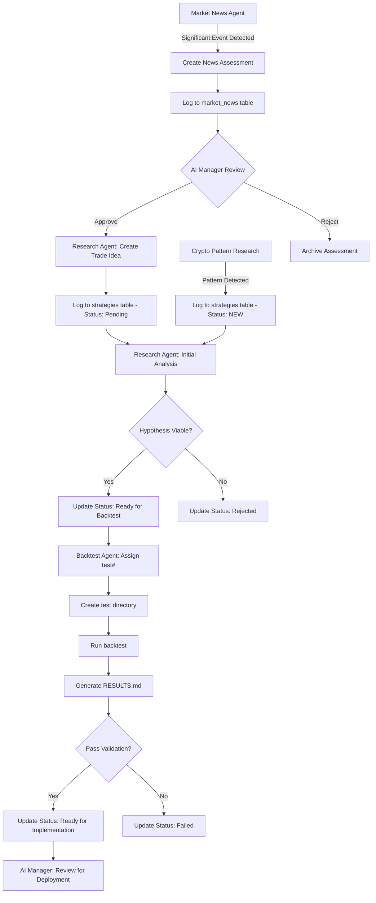
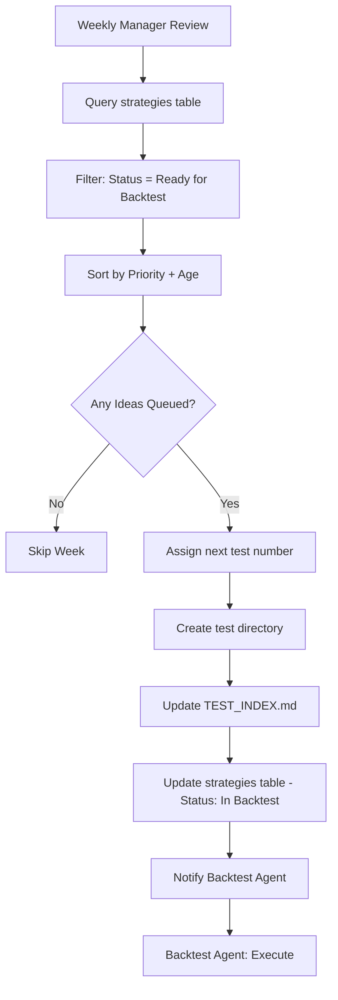
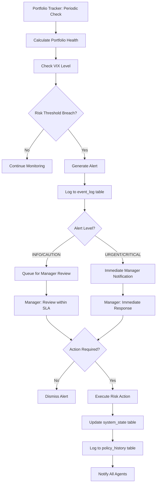
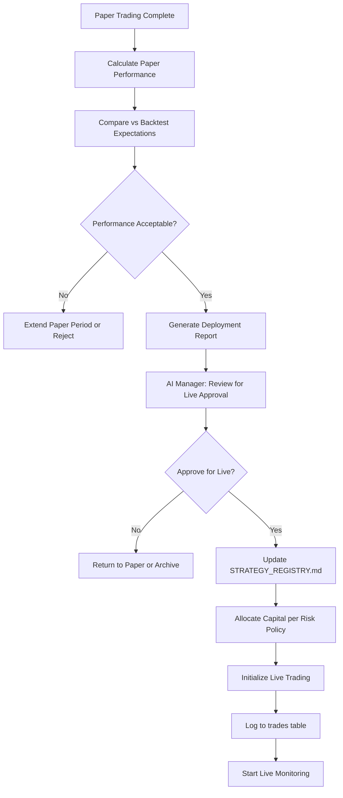
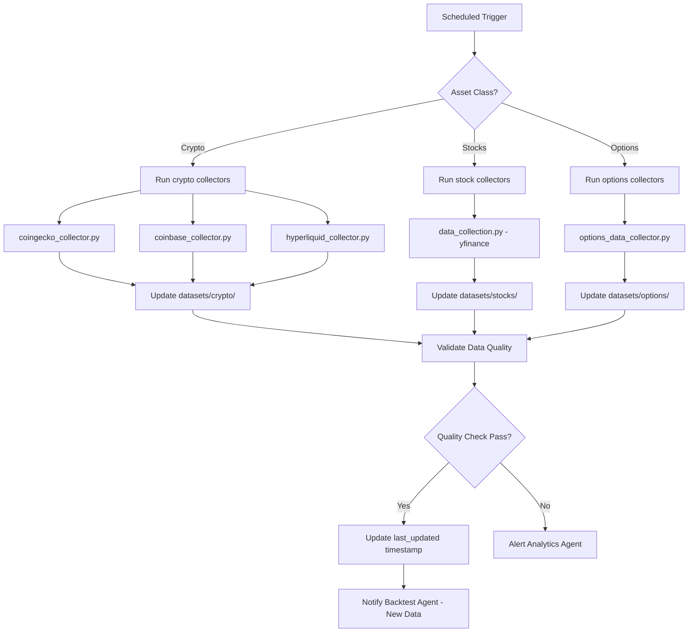
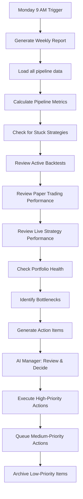
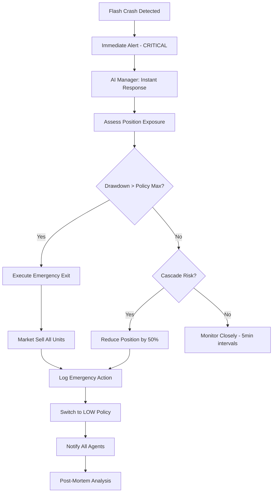

# Automation Workflows

## Overview

This document describes the **automated pipelines** in the TradeBot system that enable seamless strategy generation, testing, and deployment. These workflows minimize manual intervention while maintaining strict quality controls through the AI Manager.

**Last Updated**: 2026-02-03

---

## Core Automation Philosophy

The TradeBot system operates on a **push-based automation model** where:
- **Market News Agent** monitors external signals and pushes actionable ideas
- **Research Agent** validates and formalizes trade ideas
- **Crypto Pattern Research** continuously scans all tradeable crypto for technical pattern signals via pluggable detectors
- **Backtest Agent** tests strategies against historical data
- **Portfolio Tracker** monitors live positions and recommends adjustments
- **AI Manager** orchestrates all workflows and makes final decisions

All automation respects the risk policy framework and delegation rules defined in [DELEGATION_RULES.md](DELEGATION_RULES.md).

---

## Workflow 1: News → Research → Backtest Pipeline

### Trigger
Market News Agent identifies high-impact news that could lead to trading opportunities.

### Automated Steps



### File Interactions

| Step | Agent | File Modified | Status Change |
|------|-------|---------------|---------------|
| 1 | Market News | `market_news` table | New entry |
| 2 | AI Manager | N/A | Review decision logged |
| 3 | Research | `strategies` table | `Pending` |
| 4 | Research | `strategies` table | `Ready for Backtest` or `Rejected` |
| 5 | Backtest | `data/backtests/TEST_INDEX.md` | Add to "In Progress" |
| 6 | Backtest | `data/backtests/test<N>/RESULTS.md` | Create documentation |
| 7 | Backtest | `strategies` table | `Completed - Pass` or `Completed - Fail` |
| 8 | Backtest | `data/backtests/TEST_INDEX.md` | Move to "Completed" |
| 9 | AI Manager | `STRATEGY_REGISTRY.md` | Add to "Ready for Implementation" |

### Timing Expectations

**For Stock Strategies**:
- News Assessment → Trade Idea: **24-48 hours**
- Trade Idea → Backtest Start: **2-7 days** (research phase)
- Backtest Execution: **5-14 days** (depending on complexity)
- Total Pipeline: **~14-30 days**

**For Crypto Strategies**:
- News Assessment → Trade Idea: **12-24 hours**
- Trade Idea → Backtest Start: **1-3 days** (faster due to higher volatility)
- Backtest Execution: **3-7 days**
- Total Pipeline: **~7-14 days**

### AI Manager Decision Points

1. **News Assessment Approval** (Step 4)
   - Criteria: Does this news represent a genuine trading opportunity?
   - Auto-approve: No (requires Manager review)

2. **Backtest Results Review** (Step S)
   - Criteria: All validation tests passed? Overfitting risk acceptable?
   - Auto-approve: Yes, if all metrics meet HIGH policy thresholds

---

## Workflow 2: Scheduled Backtest Queue Processing

### Trigger
AI Manager runs weekly review of research pipeline and assigns backtests to queued ideas.

### Automated Steps



### Configuration

From [system_config.yaml](../config/system_config.yaml):

```yaml
backtest:
  max_concurrent_tests: 3
  auto_assign: true
  priority_order: ["high", "medium", "low"]
  max_queue_age_days: 60  # Alert if idea stuck >60 days
```

### Priority Rules

| Priority | Criteria | Typical Backtest Order |
|----------|----------|----------------------|
| **High** | High-conviction idea, urgent market conditions, Manager flagged | Test within 1 week |
| **Medium** | Standard research output, normal market | Test within 2-4 weeks |
| **Low** | Experimental, low-confidence, educational | Test within 4-8 weeks |

### Automation Guardrails

- **Max Concurrent Tests**: 3 backtests running simultaneously
- **Stale Idea Alert**: If idea is "Ready for Backtest" for >60 days, escalate to Manager
- **Resource Check**: Ensure sufficient data and compute resources before assigning

---

## Workflow 3: Live Portfolio Monitoring → Policy Adjustment

### Trigger
Portfolio Tracker detects risk threshold breach or VIX-based policy change condition.

### Automated Steps



### Alert Response Times

From [DELEGATION_RULES.md](DELEGATION_RULES.md):

| Alert Level | Stocks Response | Crypto Response | AI Manager Advantage |
|-------------|----------------|-----------------|---------------------|
| **INFO** | 24-48 hours | 12-24 hours | Always available |
| **CAUTION** | 24 hours | 4-6 hours | Instant context switch |
| **URGENT** | 4 hours | 1-2 hours | No sleep needed |
| **CRITICAL** | 1 hour | 15-30 minutes | Sub-second analysis |

### Automated Policy Switching

**VIX-Based Triggers** (from RISK_POLICY_FRAMEWORK.md):

| Current Policy | VIX Threshold | New Policy | Auto-Switch? |
|----------------|---------------|------------|--------------|
| HIGH | VIX > 30 | MODERATE | **Yes** (logged) |
| MODERATE | VIX > 40 | LOW | **Yes** (logged) |
| MODERATE | VIX < 20 | HIGH | No (Manager approval) |
| LOW | VIX < 25 | MODERATE | No (Manager approval) |

**Drawdown-Based Triggers**:

| Current Policy | Drawdown | Action | Auto-Execute? |
|----------------|----------|--------|---------------|
| HIGH | -22% | Circuit breaker + switch to MODERATE | **Yes** |
| MODERATE | -18% | Circuit breaker + switch to LOW | **Yes** |
| LOW | -12% | Circuit breaker + Manager escalation | **Yes** |

---

## Workflow 4: Paper Trading → Live Deployment

### Trigger
Strategy completes successful paper trading period (default 60 days).

### Automated Steps



### Performance Validation Criteria

From [system_config.yaml](../config/system_config.yaml):

```yaml
paper_trading:
  min_duration_days: 60
  validation_thresholds:
    sharpe_vs_backtest_min: 0.70  # Paper Sharpe ≥ 70% of backtest
    drawdown_vs_backtest_max: 1.30  # Paper DD ≤ 130% of backtest
    min_trades_executed: 30  # At least 30 paper trades
```

### Capital Allocation Logic

**For HIGH Risk Policy**:
- New strategy: Start at **5% portfolio allocation**
- Scale up: +2.5% per month if performing
- Max allocation: **30% single position**

**For MODERATE Risk Policy**:
- New strategy: Start at **3% portfolio allocation**
- Scale up: +1.5% per month if performing
- Max allocation: **20% single position**

**For LOW Risk Policy**:
- New strategy: Start at **2% portfolio allocation**
- Scale up: +1% per month if performing
- Max allocation: **12% single position**

---

## Workflow 5: Data Collection & Update Pipeline

### Trigger
Scheduled data refresh (configurable per asset class).

### Automated Steps



### Data Collection Schedule

From [system_config.yaml](../config/system_config.yaml):

| Asset Class | Update Frequency | Collector | Priority |
|-------------|-----------------|-----------|----------|
| **Crypto** | Every 6 hours | coingecko, coinbase, hyperliquid | High |
| **Stocks** | Daily (after market close) | yfinance | Medium |
| **Options** | Daily (after market close) | yfinance + CBOE | Medium |
| **VIX** | Every 1 hour (market hours) | yfinance | Critical |

### Data Quality Validation

**Automated Checks**:
- ✅ No missing timestamps in last 7 days
- ✅ OHLCV values are positive and reasonable
- ✅ Volume > 0 for liquid assets
- ✅ No duplicate timestamps
- ✅ Data format matches [DATA_SCHEMAS.md](DATA_SCHEMAS.md)

**Failure Actions**:
- Log error to `datasets/data_quality_log.csv`
- Alert Analytics Agent for manual review
- Use cached data if available
- Skip backtest execution if data insufficient

---

## Workflow 6: Weekly Manager Review Cycle

### Trigger
Every Monday 9:00 AM (configurable)

### Automated Steps



### Weekly Review Checklist

From [STRATEGY_REGISTRY.md](../STRATEGY_REGISTRY.md):

- [ ] Check for stuck strategies (>30 days in same status)
- [ ] Verify backtest pipeline is moving (at least 1 active test)
- [ ] Confirm paper trading performance vs backtest expectations
- [ ] Review live strategy performance vs benchmarks
- [ ] Update conversion rates and timeline averages
- [ ] Identify bottlenecks in the pipeline

### Performance Metrics Tracked

```python
# From agents/analytics/analytics_dashboard.py
weekly_metrics = {
    "pipeline_conversion": {
        "research_to_backtest": "N/A",
        "backtest_to_validated": "100% (1/1)",
        "validated_to_paper": "0% (0/1)",
        "paper_to_live": "N/A"
    },
    "average_timelines": {
        "research_duration": "N/A",
        "backtest_duration": "5 days (test1)",
        "paper_duration": "Target 60 days",
        "total_idea_to_live": "Target 60-120 days"
    },
    "active_strategies": {
        "live": 0,
        "paper": 0,
        "in_backtest": 0,
        "in_research": 0
    },
    "alerts_summary": {
        "critical": 0,
        "urgent": 0,
        "caution": 0,
        "info": 0
    }
}
```

---

## Workflow 7: Crypto Flash Crash Response

### Trigger
Portfolio Tracker detects >15% price drop in <15 minutes for any crypto position.

### Automated Steps (CRITICAL Priority)



### Response Timeline (Crypto)

| Event | Detection | Manager Alert | Decision | Execution | Total |
|-------|-----------|--------------|----------|-----------|-------|
| Flash Crash | Real-time | <30 seconds | <1 minute | <2 minutes | **~3 minutes** |

This is **only possible** because the AI Manager is autonomous and available 24/7 with instant decision-making.

### Crypto-Specific Triggers

From [DELEGATION_RULES.md](DELEGATION_RULES.md):

| Event | Threshold | Alert Level | Auto-Action |
|-------|-----------|-------------|-------------|
| **Flash Crash** | -15% in <15min | CRITICAL | Reduce/exit position |
| **Liquidation Cascade** | Funding rate >0.5% | URGENT | Reduce leverage |
| **Whale Movement** | >$100M on-chain | CAUTION | Monitor closely |
| **Exchange Issues** | API errors >5 in 10min | URGENT | Halt new orders |

---

## Automation Guardrails & Safety

### Circuit Breakers

All automation respects circuit breaker thresholds:

| Policy | Drawdown Trigger | Action | Resume Condition |
|--------|-----------------|--------|------------------|
| **HIGH** | -22% | Halt all new positions | Manager manual approval |
| **MODERATE** | -18% | Halt all new positions | VIX < 25 for 3 days |
| **LOW** | -12% | Halt all new positions | VIX < 20 for 5 days |

### Manual Override

AI Manager can **always** override automation:
- Pause any workflow
- Skip validation steps (with logged justification)
- Force policy change
- Emergency exit all positions

### Logging & Audit Trail

**All automated actions are logged** to:
- `event_log` table - All alerts
- `policy_history` table - Policy changes
- `trades` table - All order executions
- `strategies` table - Pipeline status changes

### Fail-Safe Defaults

If automation encounters errors:
1. **Log error** to appropriate log file
2. **Notify AI Manager** with URGENT alert
3. **Default to conservative action** (e.g., reduce position, switch to MODERATE policy)
4. **Never auto-execute** high-risk actions (leverage >2x, position >30%)

---

## Integration Testing

### Workflow Validation Scripts

Recommended test suite in `scripts/test_automation.py`:

```python
# Test News → Research pipeline
def test_news_to_research_pipeline():
    # 1. Create mock news assessment
    # 2. Verify trade idea created
    # 3. Check strategies table updated
    pass

# Test VIX-based policy switching
def test_vix_policy_automation():
    # 1. Mock VIX > 30
    # 2. Verify policy switches to MODERATE
    # 3. Check system_state and policy_history tables
    pass

# Test flash crash response
def test_flash_crash_automation():
    # 1. Mock -20% price drop in 10 minutes
    # 2. Verify CRITICAL alert generated
    # 3. Check position reduction executed
    pass
```

---

## Configuration Management

All automation workflows are configured in [system_config.yaml](../config/system_config.yaml):

```yaml
automation:
  enabled: true

  workflows:
    news_to_research:
      enabled: true
      auto_approve_news: false  # Always require Manager review

    backtest_queue:
      enabled: true
      schedule: "weekly"  # Every Monday
      max_concurrent: 3

    portfolio_monitoring:
      enabled: true
      check_interval_minutes: 15  # Stocks
      check_interval_minutes_crypto: 5  # Crypto

    paper_to_live:
      enabled: true
      auto_approve: false  # Always require Manager review

    data_collection:
      enabled: true
      schedule:
        crypto: "*/6 * * * *"  # Every 6 hours
        stocks: "0 17 * * 1-5"  # Daily after market close
        vix: "0 * * * *"  # Hourly

  alerts:
    email_notifications: false  # AI Manager doesn't need email
    log_all_alerts: true

  safety:
    circuit_breakers_enabled: true
    manual_override_allowed: true
    default_to_conservative: true
```

---

## Future Enhancements

### Planned Automation Features

1. **Sentiment Analysis Pipeline**
   - Automatically analyze social media trends
   - Generate trade ideas from sentiment shifts
   - Target Q2 2026

2. **Multi-Asset Correlation Monitoring**
   - Detect correlation breakdowns
   - Auto-adjust hedges
   - Target Q3 2026

3. **Machine Learning Model Retraining**
   - Auto-retrain backtested models with new data
   - Validate performance degradation
   - Target Q4 2026

4. **Cross-Strategy Optimization**
   - Automatically rebalance capital across strategies
   - Maximize portfolio Sharpe ratio
   - Target Q1 2027

---

## Quick Reference

### Key Automation Files

| File | Purpose | Update Frequency |
|------|---------|------------------|
| [DELEGATION_RULES.md](DELEGATION_RULES.md) | Authority boundaries | Quarterly review |
| [system_config.yaml](../config/system_config.yaml) | Automation settings | As needed |
| [RISK_POLICY_FRAMEWORK.md](RISK_POLICY_FRAMEWORK.md) | Risk thresholds | Quarterly review |
| [DATA_SCHEMAS.md](DATA_SCHEMAS.md) | Data validation rules | As needed |

### Contact & Escalation

**AI Manager Authority**: Ultimate decision-maker for all workflows
**Portfolio Tracker**: Recommends risk actions, executes Manager-approved orders
**Escalation Path**: Portfolio Tracker → AI Manager → [Optional: Human oversight for extreme events]

---

**This document is maintained by the AI Manager and should be reviewed quarterly to ensure automation workflows remain efficient and safe.**
